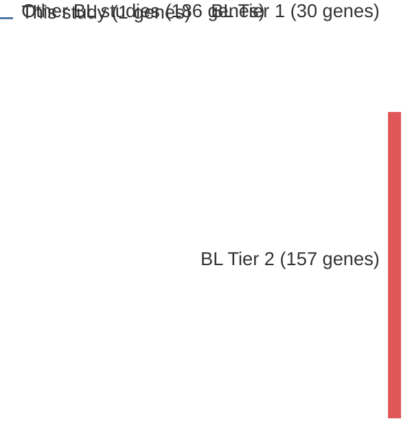

# @wildaInactivationARFMDM2p53Pathway2004
## Summary of novel genes

|Entity| Tier 1 genes| Tier 2 genes|
|:-:|:-:|:-:|
|BL|1||

## Novel genes reported in this study

|New gene|BL tier|
|:-|:-:|
|[TP53](TP53)|1 |

# Details

