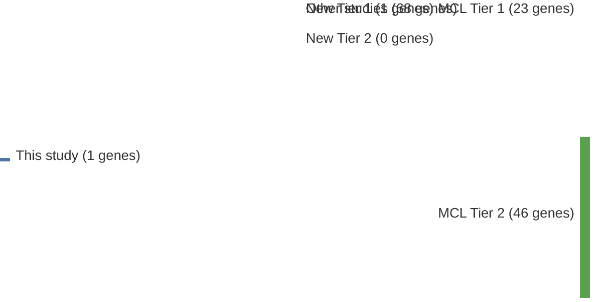

# @wuGeneticHeterogeneityPrimary2016
## Summary of novel genes

|Entity| Tier 1 genes| Tier 2 genes|
|:-:|:-:|:-:|
|MCL|1||

## Novel genes reported in this study

|New gene|MCL tier|
|:-|:-:|
|[CARD11](CARD11)|1 |

# Details

