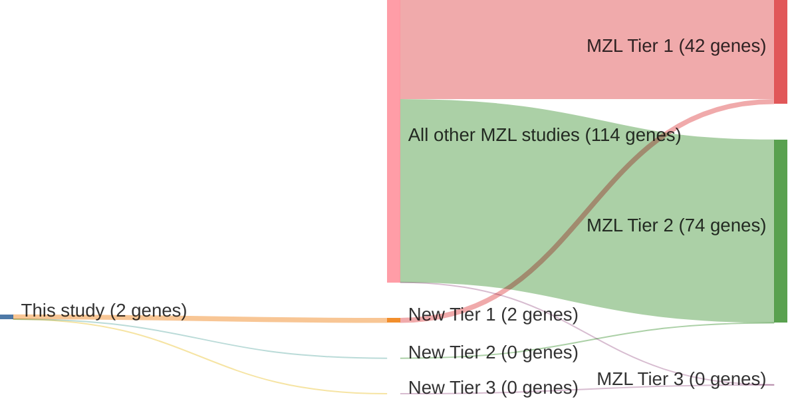

# @yanBCRTLRSignaling2012
## Summary of novel genes

|Entity| Tier 1 genes| Tier 2 genes|Tier 3 genes|
|:-:|:-:|:-:|:-:|
|MZL|2|0|0|

## Novel genes reported in this study

### Tier 1
|New gene|MZL tier|
|:-|:-:|
|[CARD11](../CARD11)|1 |
|[MYD88](../MYD88)|1 |

# Details

