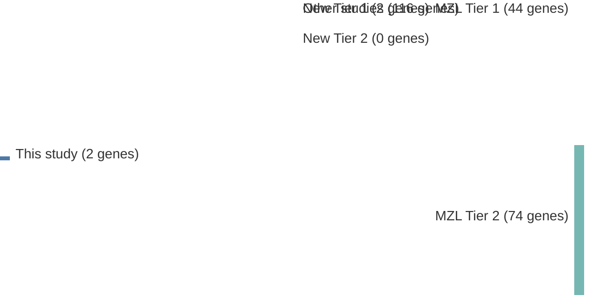

# @yanBCRTLRSignaling2012a
## Summary of novel genes

|Entity| Tier 1 genes| Tier 2 genes|
|:-:|:-:|:-:|
|MZL|2||

## Novel genes reported in this study

|New gene|MZL tier|
|:-|:-:|
|[CARD11](CARD11)|1 |
|[MYD88](MYD88)|1 |

# Details

