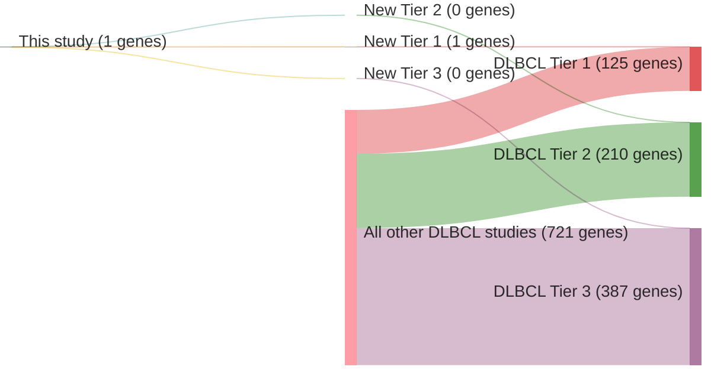

# @yildizActivatingSTAT6Mutations2015
## Summary of novel genes

|Entity| Tier 1 genes| Tier 2 genes|Tier 3 genes|
|:-:|:-:|:-:|:-:|
|DLBCL|1|0|0|
|FL|1|0|0|

## Novel genes reported in this study

### Tier 1
|New gene|DLBCL tier|FL tier|
|:-|:-:|:-:|
|[STAT6](../STAT6)|1 |1 |

# Details

