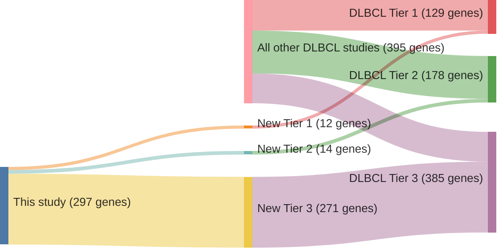

# @zhangGeneticHeterogeneityDiffuse2013
## Summary of novel genes

|Entity| Tier 1 genes| Tier 2 genes|Tier 3 genes|
|:-:|:-:|:-:|:-:|
|DLBCL|12|14|271|

## Novel genes reported in this study

### Tier 1
|New gene|DLBCL tier|
|:-|:-:|
|[ARID1A](../ARID1A)|1 |
|[DTX1](../DTX1)|1 |
|[FBXW7](../FBXW7)|1 |
|[HIST1H2BK](../HIST1H2BK)|1 |
|[KLHL14](../KLHL14)|1 |
|[KMT2C](../KMT2C)|1 |
|[LRRN3](../LRRN3)|1 |
|[MTOR](../MTOR)|1 |
|[NOTCH2](../NOTCH2)|1 |
|[OSBPL10](../OSBPL10)|1 |
|[RHOA](../RHOA)|1 |
|[TRRAP](../TRRAP)|1 |

### Tier 2
|New gene|DLBCL tier|
|:-|:-:|
|[ANKRD17](../ANKRD17)|2 |
|[BTBD3](../BTBD3)|2 |
|[DDX10](../DDX10)|2 |
|[INO80](../INO80)|2 |
|[JAK1](../JAK1)|2 |
|[JAK3](../JAK3)|2 |
|[NF1](../NF1)|2 |
|[PIK3CD](../PIK3CD)|2 |
|[PIK3R1](../PIK3R1)|2 |
|[SETD2](../SETD2)|2 |
|[SMEK1](../SMEK1)|2 |
|[STAT5B](../STAT5B)|2 |
|[UBR5](../UBR5)|2 |
|[ZEB2](../ZEB2)|2 |

### Tier 3
|New gene|DLBCL tier|
|:-|:-:|
|[ABCA3](../ABCA3)|3 |
|[ABCA4](../ABCA4)|3 |
|[ACE](../ACE)|3 |
|[ACSM3](../ACSM3)|3 |
|[ACSS2](../ACSS2)|3 |
|[ACSS3](../ACSS3)|3 |
|[ACTN1](../ACTN1)|3 |
|[ADAM2](../ADAM2)|3 |
|[ADAMTS15](../ADAMTS15)|3 |
|[ADH7](../ADH7)|3 |
|[AFAP1L2](../AFAP1L2)|3 |
|[AHR](../AHR)|3 |
|[AKAP9](../AKAP9)|3 |
|[ALAS1](../ALAS1)|3 |
|[ALDH1L2](../ALDH1L2)|3 |
|[AMAC1](../AMAC1)|3 |
|[AMIGO3](../AMIGO3)|3 |
|[AMPH](../AMPH)|3 |
|[ANK2](../ANK2)|3 |
|[ANKRD44](../ANKRD44)|3 |
|[ANTXR1](../ANTXR1)|3 |
|[AP1G2](../AP1G2)|3 |
|[APBB1](../APBB1)|3 |
|[APC](../APC)|3 |
|[APOA5](../APOA5)|3 |
|[APP](../APP)|3 |
|[ATIC](../ATIC)|3 |
|[ATP10A](../ATP10A)|3 |
|[ATP1A2](../ATP1A2)|3 |
|[ATP2A3](../ATP2A3)|3 |
|[B4GALNT2](../B4GALNT2)|3 |
|[BAZ1A](../BAZ1A)|3 |
|[BCAT2](../BCAT2)|3 |
|[BLM](../BLM)|3 |
|[BMPR1A](../BMPR1A)|3 |
|[BRCA2](../BRCA2)|3 |
|[BRD4](../BRD4)|3 |
|[BSCL2](../BSCL2)|3 |
|[BTAF1](../BTAF1)|3 |
|[C9](../C9)|3 |
|[CAD](../CAD)|3 |
|[CAPN5](../CAPN5)|3 |
|[CAPN7](../CAPN7)|3 |
|[CCDC132](../CCDC132)|3 |
|[CCDC46](../CCDC46)|3 |
|[CCDC97](../CCDC97)|3 |
|[CCNF](../CCNF)|3 |
|[CDC123](../CDC123)|3 |
|[CDH10](../CDH10)|3 |
|[CDH7](../CDH7)|3 |
|[CDK3](../CDK3)|3 |
|[CECR1](../CECR1)|3 |
|[CELSR2](../CELSR2)|3 |
|[CHD3](../CHD3)|3 |
|[CHRM5](../CHRM5)|3 |
|[CIC](../CIC)|3 |
|[CNGA4](../CNGA4)|3 |
|[CNOT6](../CNOT6)|3 |
|[CNP](../CNP)|3 |
|[CNTN6](../CNTN6)|3 |
|[COL5A2](../COL5A2)|3 |
|[CORO2A](../CORO2A)|3 |
|[CORO7](../CORO7)|3 |
|[CRELD2](../CRELD2)|3 |
|[CRTC3](../CRTC3)|3 |
|[CST7](../CST7)|3 |
|[CTNNA3](../CTNNA3)|3 |
|[CYP24A1](../CYP24A1)|3 |
|[CYP2C18](../CYP2C18)|3 |
|[DDB1](../DDB1)|3 |
|[DIAPH3](../DIAPH3)|3 |
|[DIP2B](../DIP2B)|3 |
|[DLGAP1](../DLGAP1)|3 |
|[DMXL1](../DMXL1)|3 |
|[DOCK2](../DOCK2)|3 |
|[DOLK](../DOLK)|3 |
|[DSC2](../DSC2)|3 |
|[DSCAML1](../DSCAML1)|3 |
|[DSG2](../DSG2)|3 |
|[DSP](../DSP)|3 |
|[DUOXA2](../DUOXA2)|3 |
|[DUPD1](../DUPD1)|3 |
|[DYNC1H1](../DYNC1H1)|3 |
|[DYNC1I1](../DYNC1I1)|3 |
|[ECGF1](../ECGF1)|3 |
|[EPHA3](../EPHA3)|3 |
|[EPHA5](../EPHA5)|3 |
|[EPHA7](../EPHA7)|3 |
|[ERBB3](../ERBB3)|3 |
|[ERN2](../ERN2)|3 |
|[ETNPPL](../ETNPPL)|3 |
|[EXTL3](../EXTL3)|3 |
|[FAM62C](../FAM62C)|3 |
|[FANCD2](../FANCD2)|3 |
|[FGD3](../FGD3)|3 |
|[FGFR1](../FGFR1)|3 |
|[FIGN](../FIGN)|3 |
|[FLNC](../FLNC)|3 |
|[FMO2](../FMO2)|3 |
|[FRMPD1](../FRMPD1)|3 |
|[GABRG1](../GABRG1)|3 |
|[GCN1L1](../GCN1L1)|3 |
|[GJA8](../GJA8)|3 |
|[GJB4](../GJB4)|3 |
|[GOPC](../GOPC)|3 |
|[GPD2](../GPD2)|3 |
|[GPR133](../GPR133)|3 |
|[GPR15](../GPR15)|3 |
|[GREM2](../GREM2)|3 |
|[GRIA2](../GRIA2)|3 |
|[GRM5](../GRM5)|3 |
|[H6PD](../H6PD)|3 |
|[HACE1](../HACE1)|3 |
|[HCK](../HCK)|3 |
|[HIPK3](../HIPK3)|3 |
|[HIST1H4I](../HIST1H4I)|3 |
|[HK3](../HK3)|3 |
|[HNRNPR](../HNRNPR)|3 |
|[HSF2](../HSF2)|3 |
|[IDH1](../IDH1)|3 |
|[INSC](../INSC)|3 |
|[INTS6](../INTS6)|3 |
|[IQGAP1](../IQGAP1)|3 |
|[IQUB](../IQUB)|3 |
|[ITGA2](../ITGA2)|3 |
|[ITGA8](../ITGA8)|3 |
|[ITGB3](../ITGB3)|3 |
|[JAG1](../JAG1)|3 |
|[JAKMIP2](../JAKMIP2)|3 |
|[KCNA3](../KCNA3)|3 |
|[KCNAB3](../KCNAB3)|3 |
|[KCNJ6](../KCNJ6)|3 |
|[KCNT2](../KCNT2)|3 |
|[KDR](../KDR)|3 |
|[KIF21B](../KIF21B)|3 |
|[KIT](../KIT)|3 |
|[KLB](../KLB)|3 |
|[KLC3](../KLC3)|3 |
|[KLF4](../KLF4)|3 |
|[KRT6A](../KRT6A)|3 |
|[LEPREL1](../LEPREL1)|3 |
|[LIFR](../LIFR)|3 |
|[LILRA2](../LILRA2)|3 |
|[LIN7C](../LIN7C)|3 |
|[LPHN2](../LPHN2)|3 |
|[LRAP](../LRAP)|3 |
|[LRIG3](../LRIG3)|3 |
|[LRP1](../LRP1)|3 |
|[LRP10](../LRP10)|3 |
|[LRP1B](../LRP1B)|3 |
|[LRP3](../LRP3)|3 |
|[LYST](../LYST)|3 |
|[MARCHF7](../MARCHF7)|3 |
|[MBL2](../MBL2)|3 |
|[MED13L](../MED13L)|3 |
|[MIB1](../MIB1)|3 |
|[MN1](../MN1)|3 |
|[MORC2](../MORC2)|3 |
|[MPL](../MPL)|3 |
|[MTMR3](../MTMR3)|3 |
|[MYL7](../MYL7)|3 |
|[MYO5C](../MYO5C)|3 |
|[MYRIP](../MYRIP)|3 |
|[NDUFS1](../NDUFS1)|3 |
|[NELL2](../NELL2)|3 |
|[NFIB](../NFIB)|3 |
|[NFX1](../NFX1)|3 |
|[NGFR](../NGFR)|3 |
|[NIPBL](../NIPBL)|3 |
|[NLGN2](../NLGN2)|3 |
|[NLRP7](../NLRP7)|3 |
|[NPHP1](../NPHP1)|3 |
|[NPY2R](../NPY2R)|3 |
|[NRXN2](../NRXN2)|3 |
|[NSD1](../NSD1)|3 |
|[NSD2](../NSD2)|3 |
|[ONECUT1](../ONECUT1)|3 |
|[PADI1](../PADI1)|3 |
|[PAPPA2](../PAPPA2)|3 |
|[PBX1](../PBX1)|3 |
|[PCCB](../PCCB)|3 |
|[PCDE1C](../PCDE1C)|3 |
|[PCDH7](../PCDH7)|3 |
|[PCDHB1](../PCDHB1)|3 |
|[PCDHB15](../PCDHB15)|3 |
|[PCDHB3](../PCDHB3)|3 |
|[PCDHB5](../PCDHB5)|3 |
|[PCDHGA2](../PCDHGA2)|3 |
|[PDE1C](../PDE1C)|3 |
|[PDGFRA](../PDGFRA)|3 |
|[PDIA2](../PDIA2)|3 |
|[PDZRN3](../PDZRN3)|3 |
|[PDZRN4](../PDZRN4)|3 |
|[PLA2G4B](../PLA2G4B)|3 |
|[PLEKHA7](../PLEKHA7)|3 |
|[PNLIPRP1](../PNLIPRP1)|3 |
|[PNPT1](../PNPT1)|3 |
|[POLE](../POLE)|3 |
|[PPARGC1A](../PPARGC1A)|3 |
|[PPWD1](../PPWD1)|3 |
|[PRDM16](../PRDM16)|3 |
|[PRKCB1](../PRKCB1)|3 |
|[PRKCQ](../PRKCQ)|3 |
|[PROS1](../PROS1)|3 |
|[PRSS7](../PRSS7)|3 |
|[PTPN14](../PTPN14)|3 |
|[PTPRF](../PTPRF)|3 |
|[PTPRT](../PTPRT)|3 |
|[PXK](../PXK)|3 |
|[RAB3GAP1](../RAB3GAP1)|3 |
|[RAPGEF2](../RAPGEF2)|3 |
|[RBM15B](../RBM15B)|3 |
|[RELN](../RELN)|3 |
|[RFC1](../RFC1)|3 |
|[RGS1](../RGS1)|3 |
|[ROR2](../ROR2)|3 |
|[RSL1D1](../RSL1D1)|3 |
|[RUNDC1](../RUNDC1)|3 |
|[RYR1](../RYR1)|3 |
|[SAPS3](../SAPS3)|3 |
|[SCYL1](../SCYL1)|3 |
|[SEMA3A](../SEMA3A)|3 |
|[SEMA3D](../SEMA3D)|3 |
|[SEMA5A](../SEMA5A)|3 |
|[SERINC2](../SERINC2)|3 |
|[SH3PXD2B](../SH3PXD2B)|3 |
|[SHMT2](../SHMT2)|3 |
|[SIGLEC10](../SIGLEC10)|3 |
|[SLC16A7](../SLC16A7)|3 |
|[SLC4A8](../SLC4A8)|3 |
|[SLC5A1](../SLC5A1)|3 |
|[SLC9A5](../SLC9A5)|3 |
|[SOX6](../SOX6)|3 |
|[SPEG](../SPEG)|3 |
|[SPTBN1](../SPTBN1)|3 |
|[ST8SIA3](../ST8SIA3)|3 |
|[SULF2](../SULF2)|3 |
|[TAF1L](../TAF1L)|3 |
|[TAF4B](../TAF4B)|3 |
|[THBS4](../THBS4)|3 |
|[TIMM50](../TIMM50)|3 |
|[TLN2](../TLN2)|3 |
|[TMC1](../TMC1)|3 |
|[TMEM161A](../TMEM161A)|3 |
|[TMEM16E](../TMEM16E)|3 |
|[TMEM63A](../TMEM63A)|3 |
|[TPRKB](../TPRKB)|3 |
|[TRIM37](../TRIM37)|3 |
|[TRIP11](../TRIP11)|3 |
|[TSC2](../TSC2)|3 |
|[TSHZ2](../TSHZ2)|3 |
|[UHRF1BP1L](../UHRF1BP1L)|3 |
|[UNC13B](../UNC13B)|3 |
|[UQCRC1](../UQCRC1)|3 |
|[VPS13A](../VPS13A)|3 |
|[WDR65](../WDR65)|3 |
|[WDR66](../WDR66)|3 |
|[WDR67](../WDR67)|3 |
|[WIF1](../WIF1)|3 |
|[WNK4](../WNK4)|3 |
|[WT1](../WT1)|3 |
|[XDH](../XDH)|3 |
|[ZIC4](../ZIC4)|3 |
|[ZNF354A](../ZNF354A)|3 |
|[ZNF366](../ZNF366)|3 |
|[ZNF439](../ZNF439)|3 |
|[ZNF474](../ZNF474)|3 |
|[ZNF700](../ZNF700)|3 |
|[ZNF790](../ZNF790)|3 |
|[ZNF91](../ZNF91)|3 |
|[ZP1](../ZP1)|3 |

# Details

