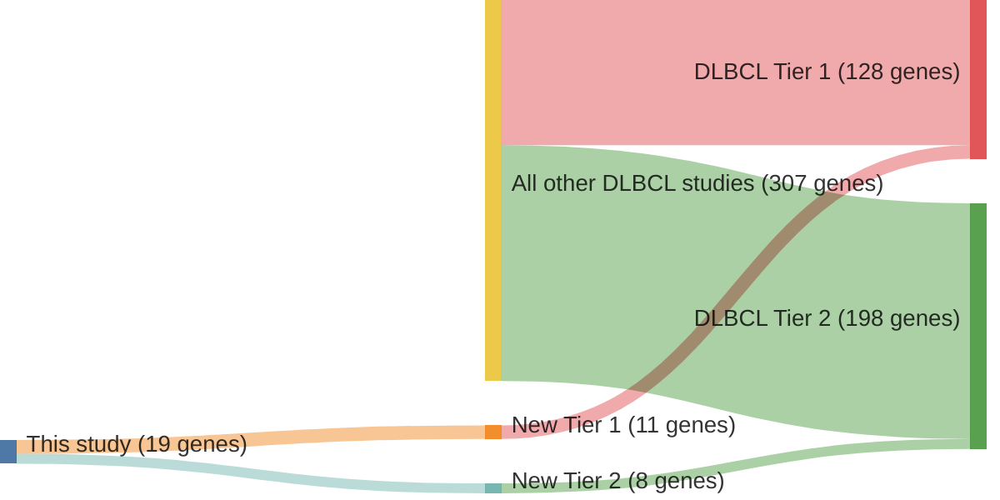

# @zhangGeneticHeterogeneityDiffuse2013
## Summary of novel genes

|Entity| Tier 1 genes| Tier 2 genes|
|:-:|:-:|:-:|
|DLBCL|11|8|

## Novel genes reported in this study

### Tier 1
|New gene|DLBCL tier|
|:-|:-:|
|[ARID1A](../ARID1A)|1 |
|[FBXW7](../FBXW7)|1 |
|[HIST1H3B](../HIST1H3B)|1 |
|[KLHL14](../KLHL14)|1 |
|[KMT2C](../KMT2C)|1 |
|[MGA](../MGA)|1 |
|[MTOR](../MTOR)|1 |
|[POU2F2](../POU2F2)|1 |
|[SMARCA4](../SMARCA4)|1 |
|[ZNF292](../ZNF292)|1 |
|[ZNF608](../ZNF608)|1 |

### Tier 2
|New gene|DLBCL tier|
|:-|:-:|
|[INO80](../INO80)|2 |
|[JAK1](../JAK1)|2 |
|[JAK3](../JAK3)|2 |
|[PIK3R1](../PIK3R1)|2 |
|[SETD2](../SETD2)|2 |
|[STAT5B](../STAT5B)|2 |
|[UBR5](../UBR5)|2 |
|[ZEB2](../ZEB2)|2 |

# Details

