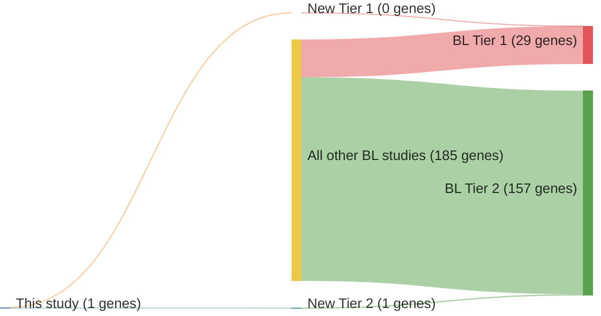

# @zhouSporadicEndemicBurkitt2019
## Summary of novel genes

|Entity| Tier 1 genes| Tier 2 genes|
|:-:|:-:|:-:|
|BL|0|1|

```mermaid
---
config:
    sankey:
        showValues: true
        linkColor: target
        width: 600
        height: 300
        nodeAlignment: right
        prefix: '('
        suffix: ' genes)'
---
sankey-beta
This study, New Tier 1, 0
New Tier 1, BL Tier 1, 0
This study, New Tier 2, 1
New Tier 2, BL Tier 2, 1
All other BL studies, BL Tier 1, 29
All other BL studies, BL Tier 2, 156
```

### Tier 2
|New gene|BL tier|
|:-|:-:|
|[KMT2C](../KMT2C)|2 |

# Details

