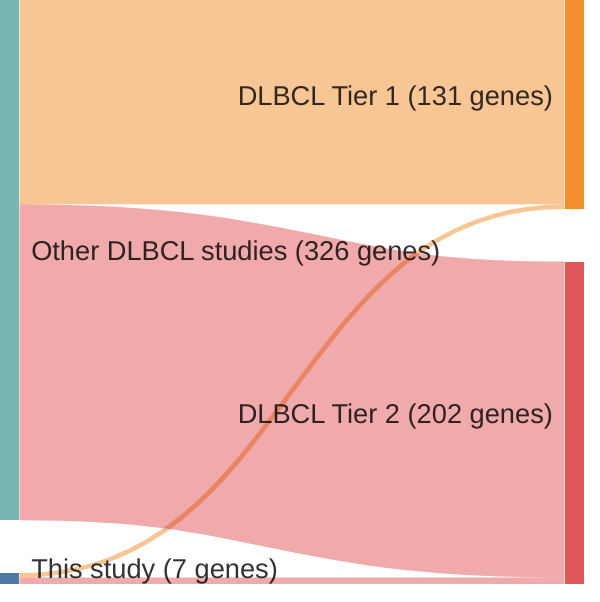

# @pasqualucciAnalysisCodingGenome2011
## Summary of novel genes

|Entity| Tier 1 genes| Tier 2 genes|
|:-:|:-:|:-:|
|DLBCL|3|4|

## Novel genes reported in this study

|New gene|DLBCL tier|
|:-|:-:|
|[CD36](CD36)|2 |
|[GRB2](GRB2)|1 |
|[HNF1B](HNF1B)|2 |
|[KLF2](KLF2)|1 |
|[MYOM2](MYOM2)|2 |
|[NOTCH1](NOTCH1)|1 |
|[TRAF3](TRAF3)|2 |

# Details

