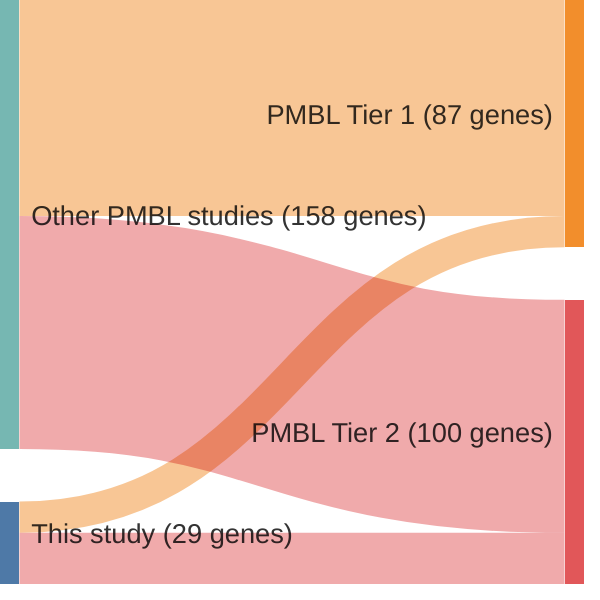

# @reichelFlowSortingExome2015a
## Summary of novel genes

|Entity| Tier 1 genes| Tier 2 genes|
|:-:|:-:|:-:|
|PMBL|11|18|

## Novel genes reported in this study

|New gene|PMBL tier|
|:-|:-:|
|[ARIH2](ARIH2)|2 |
|[B2M](B2M)|1 |
|[BCL7A](BCL7A)|2 |
|[CSF2RB](CSF2RB)|1 |
|[DMD](DMD)|2 |
|[EBF1](EBF1)|1 |
|[EEF1A1](EEF1A1)|1 |
|[EGR1](EGR1)|2 |
|[GNA13](GNA13)|1 |
|[HECW2](HECW2)|2 |
|[HELLS](HELLS)|2 |
|[HIST1H1E](HIST1H1E)|1 |
|[HIST1H3B](HIST1H3B)|2 |
|[HIST1H4C](HIST1H4C)|2 |
|[ITPKB](ITPKB)|1 |
|[MPDZ](MPDZ)|2 |
|[NEK1](NEK1)|2 |
|[PIM2](PIM2)|1 |
|[RANBP2](RANBP2)|2 |
|[SENP7](SENP7)|2 |
|[SETDB1](SETDB1)|2 |
|[SIAH2](SIAH2)|2 |
|[TBC1D15](TBC1D15)|2 |
|[TICRR](TICRR)|2 |
|[TRIP11](TRIP11)|2 |
|[UBE2A](UBE2A)|1 |
|[WEE1](WEE1)|1 |
|[ZFP36L1](ZFP36L1)|1 |
|[ZNF217](ZNF217)|2 |

# Details

