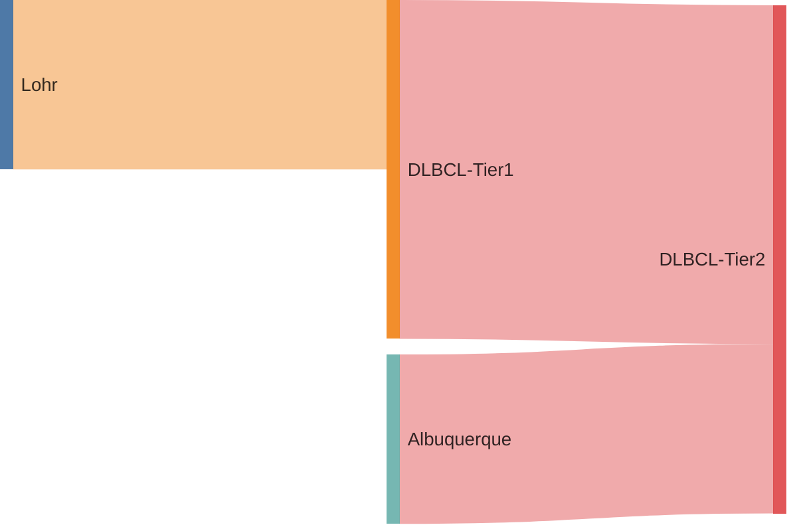
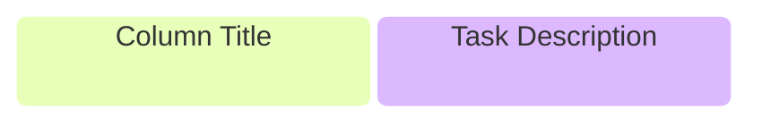
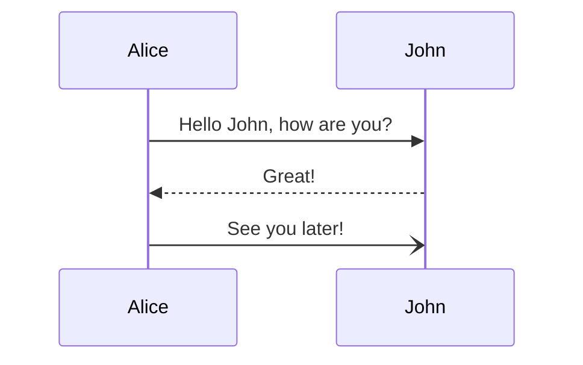

## Some title

```mermaid
---
config:
  sankey:
    showValues: false
    linkColor: target
    width: 600
    height: 400
    nodeAlignment: right
---
sankey-beta
Lohr, DLBCL-Tier1, 1
DLBCL-Tier1, DLBCL-Tier2, 2
Albuquerque, DLBCL-Tier2, 1
```

### another title

```mermaid
kanban
column1[Column Title]
task1[Task Description]
```

### yet another

```mermaid
sequenceDiagram
    Alice->>John: Hello John, how are you?
    John-->>Alice: Great!
    Alice-)John: See you later!
```
