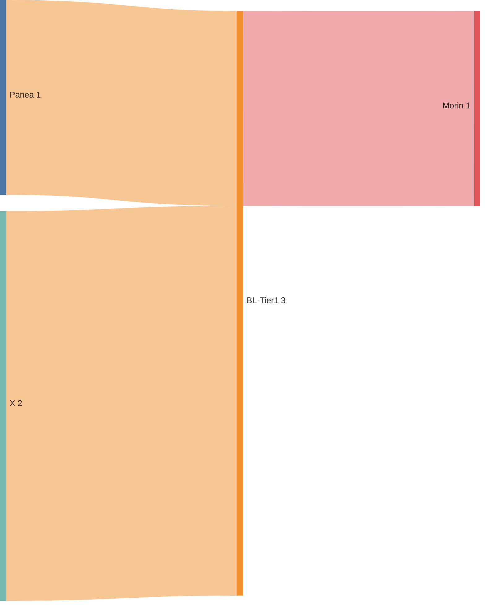

```mermaid
---
config:
  sankey:
    showValues: true
    linkColor: target
    width: 800
    height: 1000
    nodeAlignment: right
---
sankey-beta
Panea, BL-Tier1, 1
BL-Tier1, Morin, 1
X, BL-Tier1, 2
```
