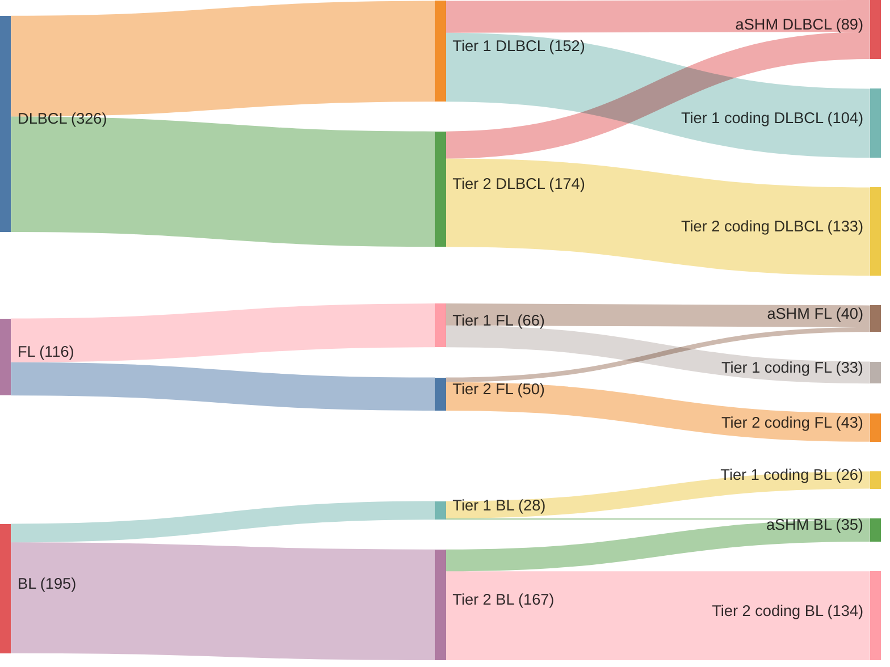

```mermaid
---
config:
  sankey:
    showValues: true
    linkColor: target
    width: 800
    height: 600
    prefix: "("
    suffix: ")"
    nodeAlignment: right
---
sankey-beta
DLBCL, Tier 1 DLBCL, 152
Tier 1 DLBCL, aSHM DLBCL, 48
Tier 1 DLBCL, Tier 1 coding DLBCL, 104

DLBCL, Tier 2 DLBCL, 174
Tier 2 DLBCL, aSHM DLBCL, 41
Tier 2 DLBCL, Tier 2 coding DLBCL, 133

FL, Tier 1 FL, 66
Tier 1 FL, aSHM FL, 33
Tier 1 FL, Tier 1 coding FL, 33

FL, Tier 2 FL, 50
Tier 2 FL, aSHM FL, 7
Tier 2 FL, Tier 2 coding FL, 43


BL, Tier 1 BL, 28
Tier 1 BL, aSHM BL, 2
Tier 1 BL, Tier 1 coding BL, 26

BL, Tier 2 BL, 167
Tier 2 BL, aSHM BL, 33
Tier 2 BL, Tier 2 coding BL, 134


```