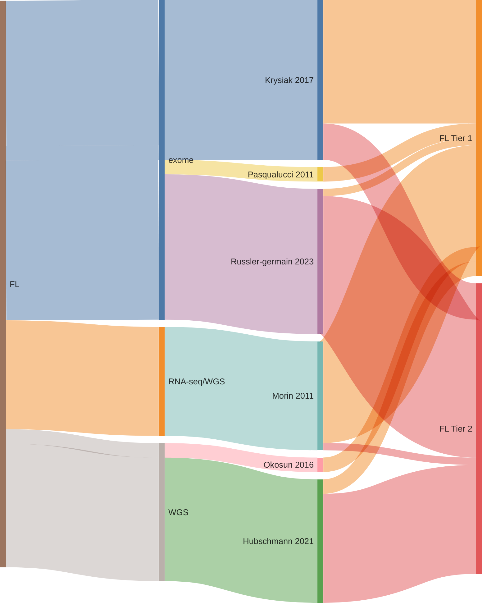

```mermaid
---
config:
  sankey:
    showValues: false
    linkColor: target
    width: 800
    height: 1000
    nodeAlignment: right
---
sankey-beta
Krysiak 2017, FL Tier 1, 17
Krysiak 2017, FL Tier 2, 5
Morin 2011, FL Tier 1, 14
Morin 2011, FL Tier 2, 1
Hubschmann 2021, FL Tier 1, 2
Hubschmann 2021, FL Tier 2, 15
Pasqualucci 2011, FL Tier 1, 2
Russler-germain 2023, FL Tier 1, 1
Russler-germain 2023, FL Tier 2, 19
Okosun 2016, FL Tier 1, 2
FL, WGS, 2
WGS, Okosun 2016, 2
FL, exome, 20
exome, Russler-germain 2023, 20
FL, exome, 2
exome, Pasqualucci 2011, 2
FL, WGS, 17
WGS, Hubschmann 2021, 17
FL, RNA-seq/WGS, 15
RNA-seq/WGS, Morin 2011, 15
FL, exome, 22
exome, Krysiak 2017, 22
```
