# Supplemental Methods and Results

## Sources of B-cell lymphoma genes

Any study that described at least one gene as recurrently mutated in
DLBCL, FL or BL was eligible to contribute to the gene lists. The
current lists relied on a total of 37 studies for DLBCL,^1--37^ 15
studies for FL,^7,10,16,19,22,26,36,38--45^ and 13 studies for
BL.^43,46--57^

## Procedure for gene retirement (Tier 3)

The pattern of mutations in Tier 2 genes has, by definition, not been
independently reproduced. To counteract the continued growth of Tier 2
over time, genes can be retired to Tier 3 in certain scenarios.
Specifically, when a new analysis or scrutiny of the original data draws
the validity of a gene or study into question, Tier 2 genes from a study
may be retired idividually or *en masse*, depending on the situation.
Ideally, the entire set of mutations that led to the original nomination
of each gene will be reviewed individually to reduce the likelihood that
a gene is retired unnecessarily. However, when systematic manual review
is impossible, genes may be retired when the originating study is deemd
to have low reproducibility. In these rare situations, all Tier 2 genes
from that study can be moved to Tier 3.

1.  Where feasible, all variants reported in the original study are
    subjected to manual review using the primary data and each mutation
    is rated on a five-point scale. Following review, any Tier 2 gene
    with an average quality score less than 3 for all variants is moved
    to Tier 3 and the other genes remain in their current Tier. The
    results from applying this procedure to genes from six studies are
    included in the [subsequent section](#manual), focusing on
    representative examples of mutations in genes that were retired.

2.  In scenarios where only some of the data are available, the quality
    of a study may instead be used to retire genes *en masse*. If a
    separate analysis of the data from the study or re-sequencing of
    samples from the study cumulatively replicates less than 50% the
    variants in Tier 2 genes, all genes arising from that study can be
    assigned to Tier 3 (unless they are already in Tier 1). This
    procedure is described in more detail at the [end of this
    document](#replicability). This study-wide retirement is an
    alternative to the first approach and should only be performed when
    all Tier 2 genes from the study cannot be individually reviewed due
    to lack of access to some or all the primary data.

## Procedure 1: Manual review `<a name="manual">`{=html}`</a>`{=html}

While establishing the current gene lists, six studies were selected for
manual review of the primary data. Studies were chosen based on data
availability and the relative proportion of orphan genes. For each
study, bam files were obtained from the European Genome-Phenome Archive
(EGA) or dbGAP. The positions reported as mutated in each patient sample
were visualized in the corresponding sequence data using IGV or
[igv-reports](https://github.com/igvteam/igv-reports). When available,
the data from the tumor and matched normal sample was visualized in
parallel. As described
[previously](https://www.biorxiv.org/content/10.1101/2023.11.21.567983v1.full),
each variant was assigned a rating on a 5-point scale with 1 reserved
for variants having the minimal support (one molecule) and 5
representing variants with the best support. For every novel gene
reported in a study, all mutations in that gene were rated. A gene was
considered to have inadequate support (failed) if the average rating of
all variants reviewed was less than 3. Representative visualizations and
the average rating for each of these genes and studies are included
below. For each study, a single example of a gene that passed manual
review is shown for comparison. The table below summarises these
studies.

::: {style="page-break-after: always;"}
:::

  -----------------------------------------------------------------------
              Study                   Methodology            Entity
  ----------------------------- ----------------------- -----------------
         [Love *et al*,                  Exome                 BL
        2012^50^](#love)                                

         [Morin *et al*,                  WGS                 DLBCL
        2013^18^](#morin)                               

         [Reddy *et al*,                 Exome                DLBCL
        2017^28^](#reddy)                               

         [Panea *et al*,             Exome/RNA-seq             BL
        2019^52^](#panea)                               

        [Chapuy *et al*,                 Exome                DLBCL
        2018^4^](#chapuy)                               

      [Hübschmann *et al*,                WGS               DLBCL,FL
        2021^10^](#icgc)                                
  -----------------------------------------------------------------------

## Procedure 2: Assessing reproducibility `<a name="replicability">`{=html}`</a>`{=html}

It is often not feasible to scrutinze each mutation in the primary data.
In lieu of this, Tier 3 status can also be applied study-wide.
Specifically, genes may be retired study-wide if a re-analysis of the
same data (or new data from the same samples) does not reproduce at
least 50% of the mutations in the Tier 2 genes from that study. Most
commonly, we anticipate this scenario will arise when two separate
studies (Study A and Study B) describe the analysis of some (or all) the
same primary data and each study releases either their variant calls or
per-gene mutation frequencies. For example, the 48 DLBCLs profiled by
The Cancer Genome Atlas (TCGA) were used in several studies. Although
each study performed their own variant calling, exome-wide variant calls
from the central analysis pipelines in Genome Data Commons (GDC) are
available from the GDC data portal.

### Option A: Comprehensive assessment

To quantify their reproducibility, three of the studies in the previous
section were also re-analyzed using our in-house variant calling
pipelines. The results are summarized in the table below. Importantly,
the threshold for determining whether a study is sufficiently
reproducible must accomodate a reasonable level of variability that
could be attributed to different variant calling strategies. We selected
the Chapuy study as a representative baseline for adequate
reproducibility. This study reported 19 genes that have not yet been
assigned to Tier 1 (Supplemental Table S7). Of the 75 mutations in these
genes, 58 (77.3%) were also detected by our analysis. In contrast, far
fewer of the mutations in the 37 and 54 genes respectively reported in
the Panea and Reddy studies were reproduced (Supplemental Table S8).
Based on this outcome, all Tier 2 genes from the Panea, Reddy and Fan
studies could be retired from their respective lists (BL for Panea,
DLBCL for the others). However, because the primary data were available
for systematic manual review, procedure 1 applies. Hence, the Tier 2
genes with a sufficiently high average variant score following review
remain in Tier 2. Notably, the high proportion of novel genes from the
Reddy and Panea study that failed manual review is consistent with a
lower degree of overall reproducibility.

### Option B: Partial assessment

We used a less comprehensive approach to evaluate the two additional
studies that each contributed a large number of Tier 2 genes (Fan *et
al* and Zhang *et al*). For the former, which analyzed TCGA data, we
relied on TCGA mutation calls from the same samples, which were obtained
from GDC data portal. Because individual mutations were not reported in
the Fan study, it was only feasible to compare the mutation incidence
per-gene between the Fan study and the GDC results. For each of the 72
Tier 2 genes from that study, we compared the total number of non-silent
mutations in that gene between the study supplement and GDC results.
Whereas Fan *et al* reported a total of 217 mutations in these genes,
there were only 81 in the GDC results (Supplemental Table S9). Because
the total number of mutations in these genes in the GDC results was less
than half of the original study (37.3%), all Tier 2 genes from this
study were retired. Notably, this approach is relatively lenient because
it assumes that the 81 mutations in the GDC results were all present in
the Fan results. If, in fact, some of the GDC variants were not
identified in the Fan analysis, the number of shared variants would be
lower.

We used another approach to assess the reproducibility of the Zhang
study. In this case, we relied on 16 samples from the Zhang study and
assumed these would be representative of the full cohort. A more recent
study by this group (Reddy *et al*) performed exome sequencing on 16 of
the samples from the Zhang cohort. We reasoned that a set of samples
subjected to whole exome sequencing by the same group should recover
most of the mutations reported in the original study. To quantify the
reproducibility of mutations in the genes reported in the Zhang study,
we compared the mutation status of each Tier 2 gene in these patients to
the results from our in-house reanalysis of these exomes, which was
performed as part of our ongoing Genomic Analysis of Mature B-cell
Lymphomas (GAMBL) project. A minority (48.7%) of the mutations in these
genes were identified by our analysis of the more recent exomes
(Supplemental Table S10). Owing to this, all Tier 2 genes from this
study were migrated to Tier 3.

  ---------------------------------------------------------------------------
       Study       Novel genes   Failed review    Mutations      Mutations
                                                   reported      reproduced
  --------------- -------------- -------------- -------------- --------------
     Chapuy^4^          19         6 (31.5%)          75         58 (77.3%)

     Panea^52^          37         22 (59.4%)        365        145 (39.7%)

     Reddy^28^          54          26 (48%)         1398       484 (34.6%)

     Fan\*^9^           73             NA            217         81 (37.3%)

   Zhang\*\*^37^       280             NA            263        128 (48.7%)
  ---------------------------------------------------------------------------

\*Mutations from this study were not released. Only gene-level
comparisons were performed.

\*\*Gene-level comparisons were performed on 16 cases overlapping the
Reddy cohort.

## Potential contribution of rare germline variants

As detailed in Supplemental Table S5, many of the studies contributing
to our gene lists did not have matched germline DNA from every sample.
It has been shown that some genes have disproportionately higher numbers
of rare germline variants. The genes with the highest number of rare
variants overall have been described in a recent study as FrequentLy
mutAted GeneS (FLAGS)^58^. These genes should be considered with caution
in any study that associates them with a phenotype. Insufficient removal
of germline variants in the studies explored herein could explain some
of the genes in Tiers 2 and 3. To evaluate this, we used the ranking of
the frequency of rare mutations in all genes covered by common exome
panels. This "FLAGS rank" assignes the lowest rank to genes with the
highest number of rare variants (e.g. TTN = 1, MUC16 = 2, OBSCN = 3,
etc). We used the distribution of ranks across the three tiers of DLBCL
genes to evaluate the relative extent to which the genes on each list
may be explained, in part, by inadequate removal of rare germline
variants. If there is no influence on genes, the FLAGS_rank is expected
to follow a uniform distribution. Accordingly, we compared each of the
four gene lists to a uniform distribution using a negative binomial
regression. Interestingly, the distributions of FLAGS_rank for Tier 2
and Tier 3 and the Cosmic Cancer Gene Census (CGC)^59^ genes were
significantly different than the uniform distribution. In contrast, the
distribution for Tier 1 genes was not significantly different from a
uniform distribution. This is consistent with the Tier 1 DLBCL genes
having minimal contamination of genes due to rare germline variants. To
evaluate whether the separation of genes into Tiers 2 and 3 offers some
benefit in this regard, we compared the Tier 2 DLBCL genes to the other
lists. Indeed, Tier 2 showed a significant difference when compared to
Tier 3 (P=3.86e-06). Based on this, we conclude that the Tier 3 gene
list is dominated by FLAGS whereas Tier 2 represents a mixture of true
DLBCL genes and FLAGS.

<figure>
``{=html}
<figcaption>
`<strong>`{=html}Supplemental Figure S1. Comparing FLAGS rank in the
DLBCL genes.`</strong>`{=html} ` `{=html} The FLAGS rank of DLBCL
genes in Tier 1, 2 and 3 is compared. The genes in the COSMIC CGC list
are included for comparison. Values closer to 1 indicate the gene has a
higher number of rare germline variants.
</figcaption>
</figure>

::: {style="page-break-after: always;"}
:::

## Representative results from manual review

### [Love *et al*, 2012](https://www.nature.com/articles/ng.2468) `<a name="love">`{=html}`</a>`{=html}

   Methodology   Pairs   Unpaired tumors   Cell lines   Tier 1   Tier 2    Tier 3
  ------------- ------- ----------------- ------------ -------- -------- ----------
      Exome       14           37              8          5        7      48 (80%)

*See also:* [IGV
reports](https://www.bcgsc.ca/downloads/morinlab/GAMBL/Love/)

### CARD4 - pass

Average rating: ★ ★ ★ ★ ☆

### ACAD9 - fail (insufficient support)

Average rating: ★ ☆ ☆ ☆ ☆

::: {style="page-break-after: always;"}
:::

### ACE - fail (insufficient support)

Average rating: ★ ☆ ☆ ☆ ☆

### ATP2C2 - fail (insufficient support)

Average rating: ★ ★ ☆ ☆ ☆

::: {style="page-break-after: always;"}
:::

### BRAF - fail (insufficient support)

Average rating: ★ ☆ ☆ ☆ ☆

### c6orf27 - fail (germline)

Average rating: Germline

::: {style="page-break-after: always;"}
:::

### BRD4 - fail (insufficient support)

Average rating: ★ ☆ ☆ ☆ ☆

### CYB5D1 - fail (insufficient support)

Average rating: ★ ☆ ☆ ☆ ☆

::: {style="page-break-after: always;"}
:::

### BTG2 - fail (insufficient support)

Average rating: ★ ☆ ☆ ☆ ☆

### CAD - fail (insufficient support)

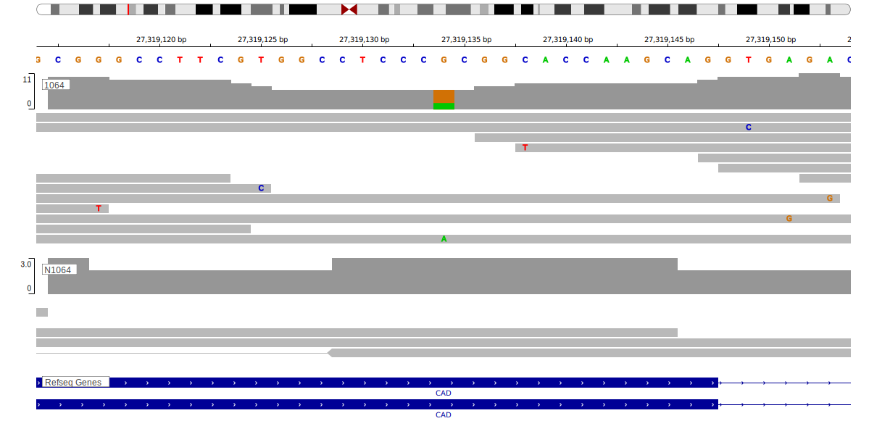

Average rating: ★ ☆ ☆ ☆ ☆

::: {style="page-break-after: always;"}
:::

### CCT6B - fail (germline)

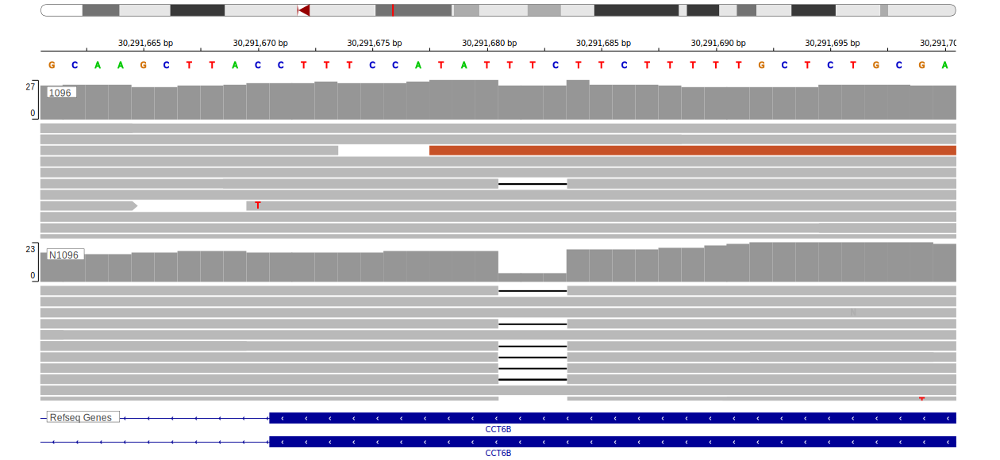

Average rating: Gremline

### CDH17 - fail (insufficient support)

Average rating: ★ ☆ ☆ ☆ ☆

::: {style="page-break-after: always;"}
:::

### COL4A2 - fail (insufficient support)

Average rating: ★ ☆ ☆ ☆ ☆

### CYP4F22 - fail (insufficient support)

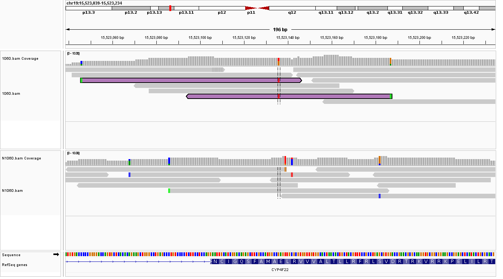

Average rating: ★ ☆ ☆ ☆ ☆

### DLGAP1 - fail (insufficient support)

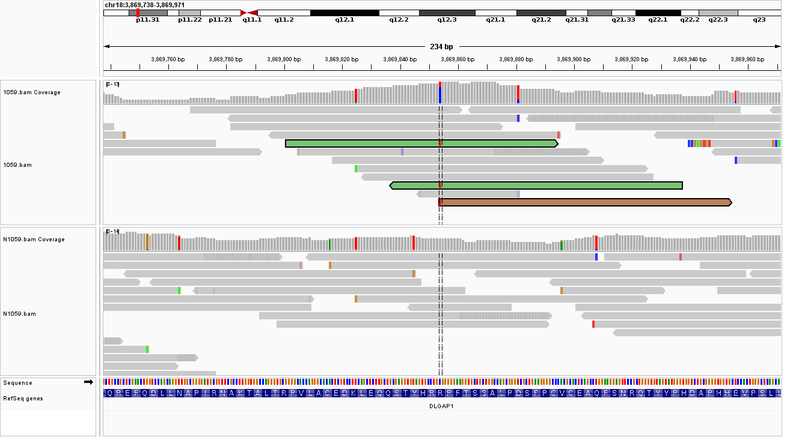

Average rating: ★ ☆ ☆ ☆ ☆

::: {style="page-break-after: always;"}
:::

### DTX1 - fail (insufficient support)

Average rating: ★ ☆ ☆ ☆ ☆

### EIF2C4 - fail (insufficient support)

Average rating: ★ ☆ ☆ ☆ ☆

::: {style="page-break-after: always;"}
:::

### EML2 - fail (insufficient support)

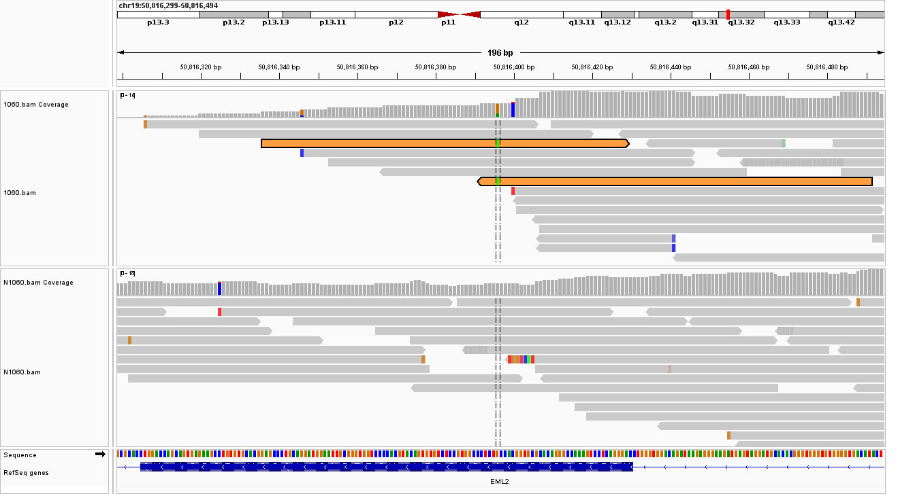

Average rating: ★ ☆ ☆ ☆ ☆

### ENTPD3 - fail (insufficient support)

Average rating: ★ ★ ☆ ☆ ☆

::: {style="page-break-after: always;"}
:::

### EPHB2 - fail (insufficient support)

Average rating: ★ ★ ☆ ☆ ☆

### FAM129B - fail (insufficient support)

Average rating: ★ ★ ☆ ☆ ☆

::: {style="page-break-after: always;"}
:::

### FGFR3 - fail (insufficient support)

Average rating: ★ ☆ ☆ ☆ ☆

### FTCD - fail (germline)

Average rating: Germline

::: {style="page-break-after: always;"}
:::

### GRIK5 - fail (insufficient support)

Average rating: ★ ☆ ☆ ☆ ☆

### ICK - fail (insufficient support)

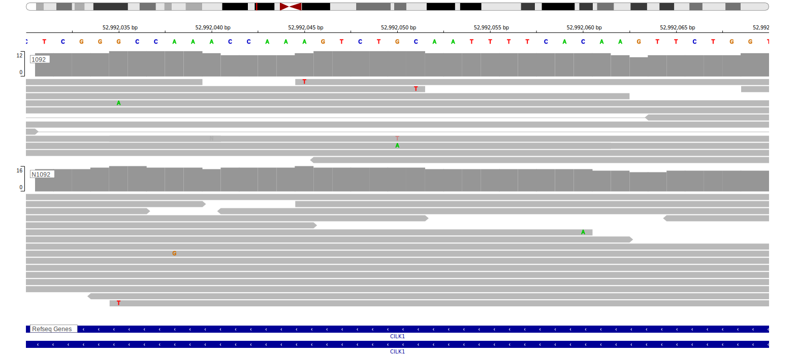

Average rating: ★ ☆ ☆ ☆ ☆

::: {style="page-break-after: always;"}
:::

### ITPR3 - fail (insufficient support)

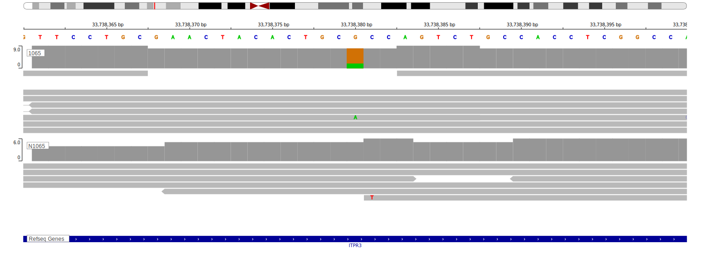

Average rating: ★ ☆ ☆ ☆ ☆

### KIFC3 - fail (insufficient support)

Average rating: ★ ☆ ☆ ☆ ☆

::: {style="page-break-after: always;"}
:::

### MAP3K6 - fail (insufficient support)

Average rating: ★ ☆ ☆ ☆ ☆

### MYH10 - fail (insufficient support)

Average rating: ★ ☆ ☆ ☆ ☆

::: {style="page-break-after: always;"}
:::

### NOTCH1 - fail (insufficient support)

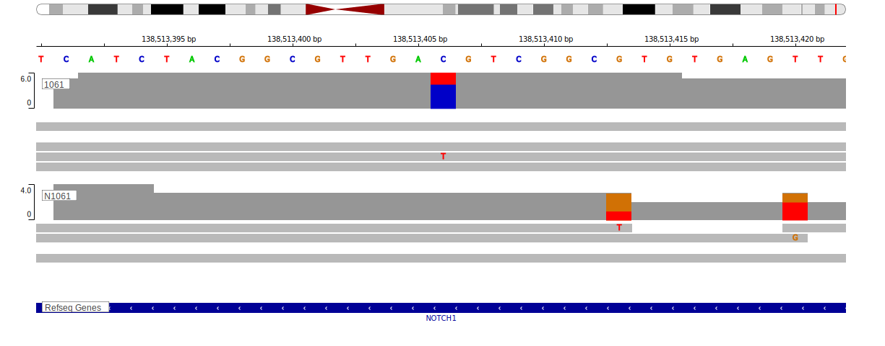

Average rating: ★ ☆ ☆ ☆ ☆

### NRXN2 - fail (insufficient support)

Average rating: ★ ☆ ☆ ☆ ☆

::: {style="page-break-after: always;"}
:::

### PC - fail (insufficient support)

Average rating: ★ ☆ ☆ ☆ ☆

### POLRMT - fail (insufficient support)

Average rating: ★ ☆ ☆ ☆ ☆

::: {style="page-break-after: always;"}
:::

### POR - fail (insufficient support)

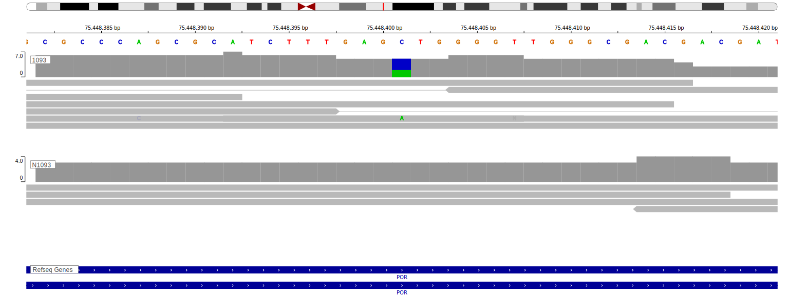

Average rating: ★ ☆ ☆ ☆ ☆

### PRSS22 - fail (insufficient support)

Average rating: ★ ☆ ☆ ☆ ☆

::: {style="page-break-after: always;"}
:::

### PTPRN - fail (insufficient support)

Average rating: ★ ☆ ☆ ☆ ☆

### RBP3 - fail (insufficient support)

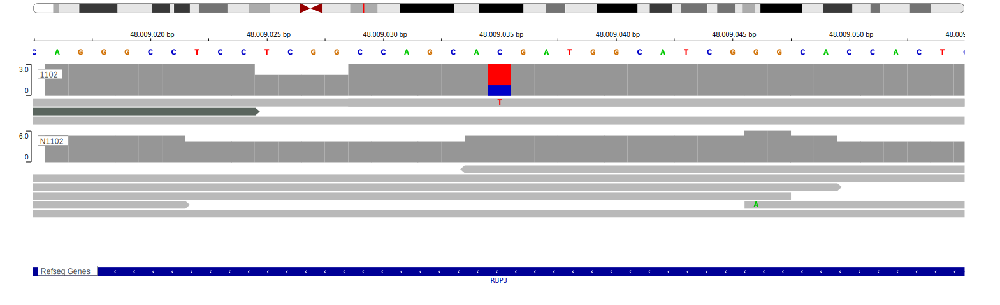

Average rating: ★ ☆ ☆ ☆ ☆

::: {style="page-break-after: always;"}
:::

### RET - fail (insufficient support)

Average rating: ★ ☆ ☆ ☆ ☆

### SALL3 - fail (insufficient support)

Average rating: ★ ★ ☆ ☆ ☆

::: {style="page-break-after: always;"}
:::

### SAPS2 - fail (insufficient support)

Average rating: ★ ☆ ☆ ☆ ☆

### SBF1 - fail (insufficient support)

Average rating: ★ ★ ☆ ☆ ☆

::: {style="page-break-after: always;"}
:::

### SF3B1 - fail (insufficient support)

Average rating: ★ ★ ★ ★ ☆

### SLC29A2 - fail (insufficient support)

Average rating: ★ ☆ ☆ ☆ ☆

::: {style="page-break-after: always;"}
:::

### SHANK1 - fail (insufficient support)

Average rating: ★ ☆ ☆ ☆ ☆

### SYNGAP1 - fail (insufficient support)

Average rating: ★ ☆ ☆ ☆ ☆

::: {style="page-break-after: always;"}
:::

### TBC1D9B - fail (insufficient support)

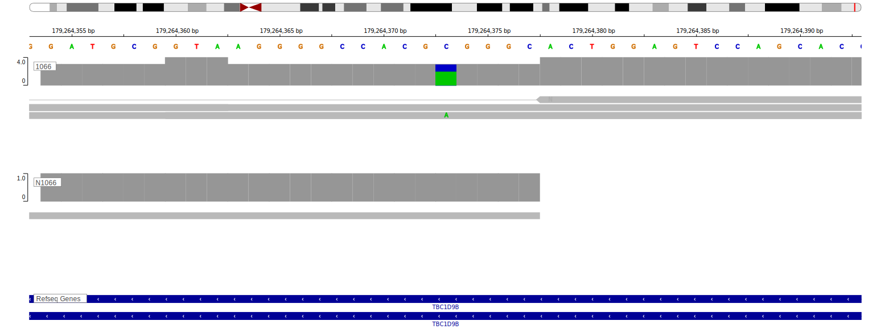

Average rating: ★ ☆ ☆ ☆ ☆

### TIGD6 - fail (insufficient support)

Average rating: ★ ☆ ☆ ☆ ☆

::: {style="page-break-after: always;"}
:::

### TPST2 - fail (insufficient support)

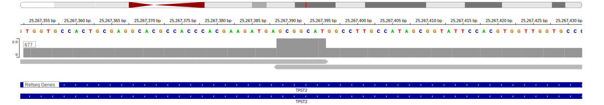

Average rating: ★ ☆ ☆ ☆ ☆

### ZNF229 - fail (germline)

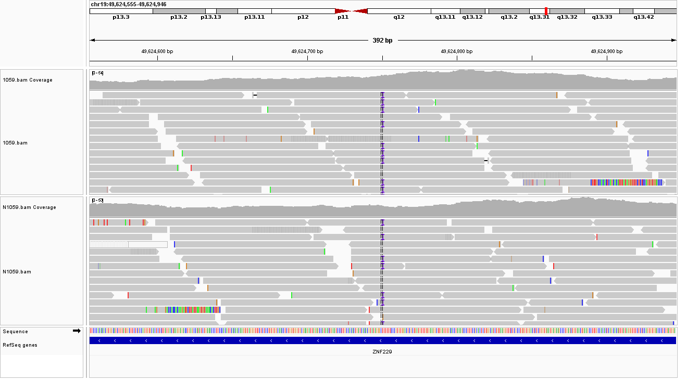

Average rating: Germline

::: {style="page-break-after: always;"}
:::

### Reddy *et al*, 2017 `<a name="reddy">`{=html}`</a>`{=html}

*See also:* [IGV
reports](https://www.bcgsc.ca/downloads/morinlab/GAMBL/Reddy/igv_reports/)

   Methodology   Pairs   Unpaired tumors   Cell lines   Tier 1   Tier 2    Tier 3
  ------------- ------- ----------------- ------------ -------- -------- ----------
      Exome       400          601             0          13       28     26 (39%)

### ARID5B - pass

Average rating: ★ ★ ★ ★ ☆

### ARID1B - fail (insufficient support)

Average rating: ★ ★ ☆ ☆ ☆

::: {style="page-break-after: always;"}
:::

### CBLB - fail (insufficient support)

Average rating: ★ ★ ☆ ☆ ☆

::: {style="page-break-after: always;"}
:::

### CDC73 - fail (insufficient support)

Average rating: ★ ★ ☆ ☆ ☆

### CHD8 - fail (insufficient support)

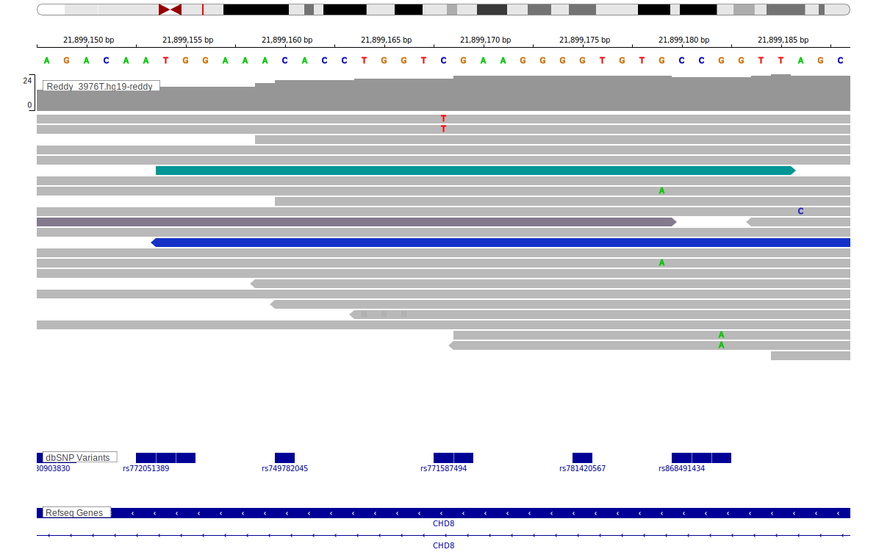

Average rating: ★ ★ ☆ ☆ ☆

::: {style="page-break-after: always;"}
:::

### CHD1 - fail (insufficient support)

Average rating: ★ ★ ☆ ☆ ☆

::: {style="page-break-after: always;"}
:::

### CHST2 - fail (insufficient support)

Average rating: ★ ★ ☆ ☆ ☆

::: {style="page-break-after: always;"}
:::

### DCAF6 - fail (insufficient support)

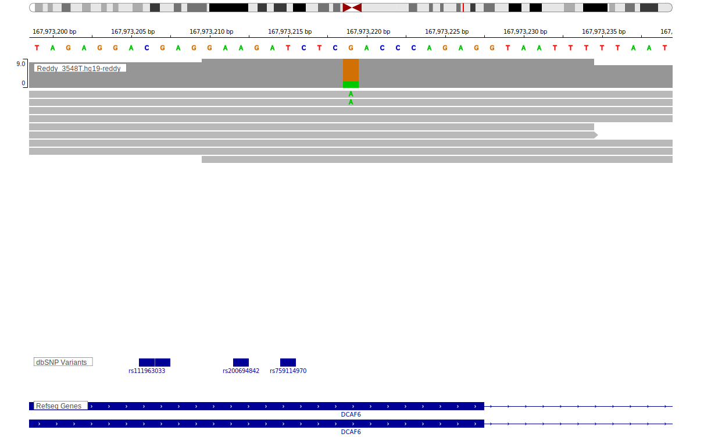

Average rating: ★ ★ ☆ ☆ ☆

::: {style="page-break-after: always;"}
:::

### DICER1 - fail (insufficient support)

Average rating: ★ ★ ☆ ☆ ☆

::: {style="page-break-after: always;"}
:::

### DNMT3A - fail (insufficient support)

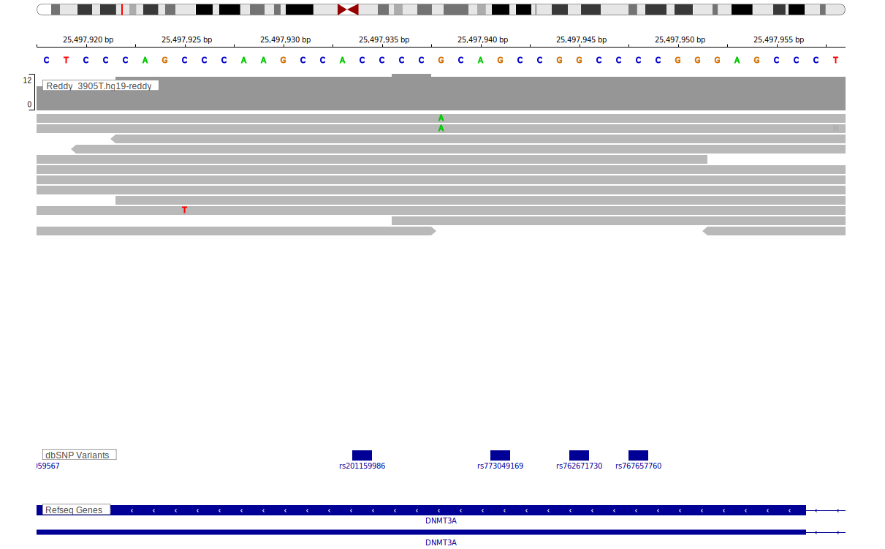

Average rating: ★ ☆ ☆ ☆ ☆

::: {style="page-break-after: always;"}
:::

### GNAS - fail (insufficient support)

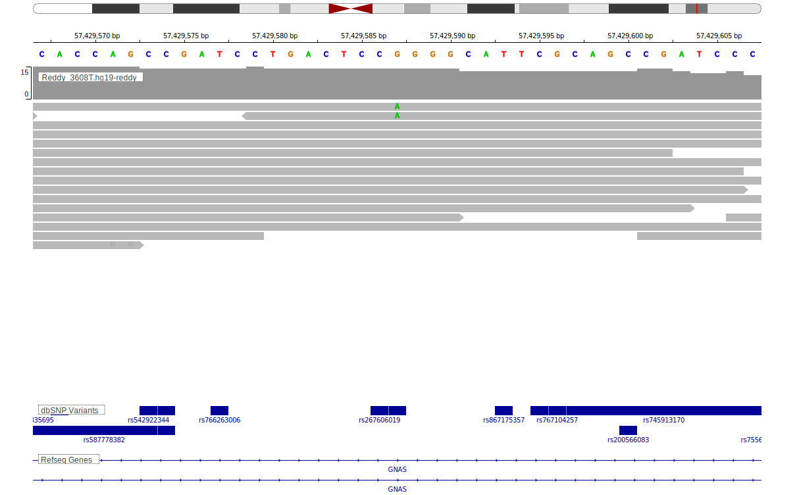

Average rating: ★ ★ ☆ ☆ ☆

::: {style="page-break-after: always;"}
:::

### HRAS - fail (insufficient support)

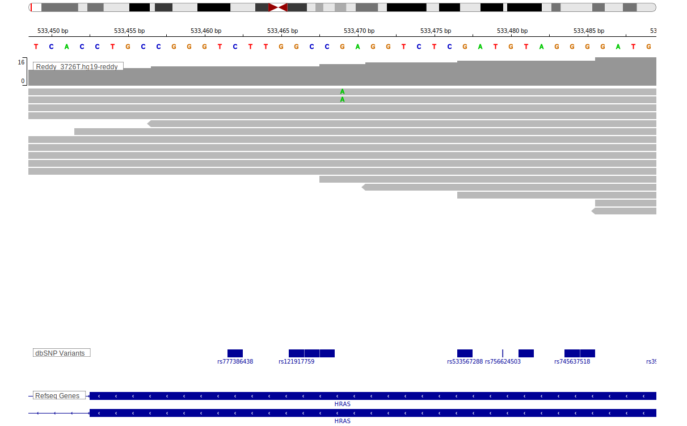

Average rating: ★ ★ ☆ ☆ ☆

::: {style="page-break-after: always;"}
:::

### LIN54 - fail (insufficient support)

Average rating: ★ ★ ☆ ☆ ☆

::: {style="page-break-after: always;"}
:::

### MAP4K4 - fail (insufficient support)

Average rating: ★ ★ ☆ ☆ ☆

::: {style="page-break-after: always;"}
:::

### MARK1 - fail (insufficient support)

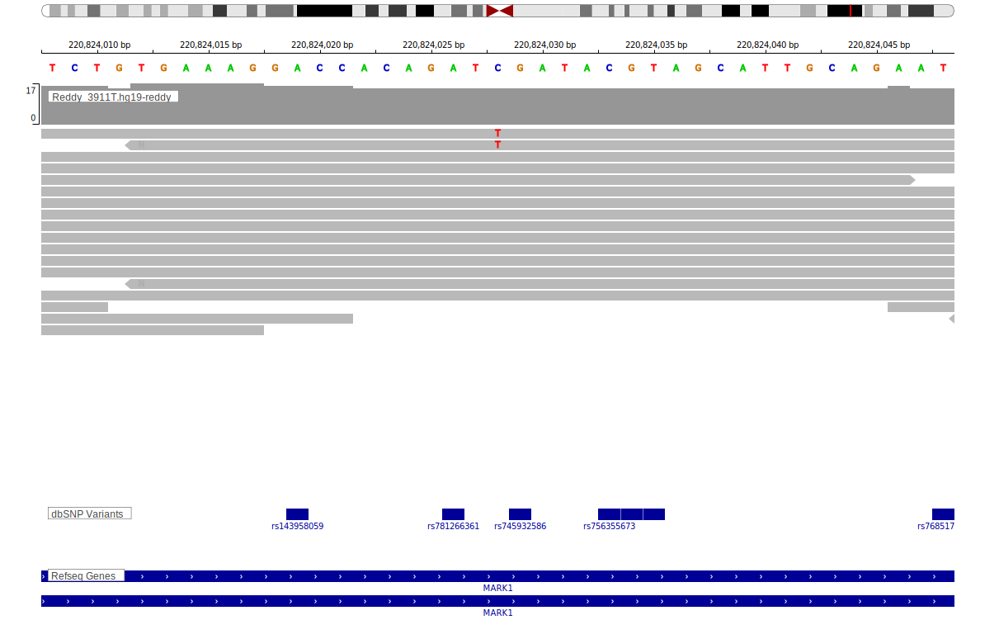

Average rating: ★ ☆ ☆ ☆ ☆

::: {style="page-break-after: always;"}
:::

### MSH2 - fail (insufficient support)

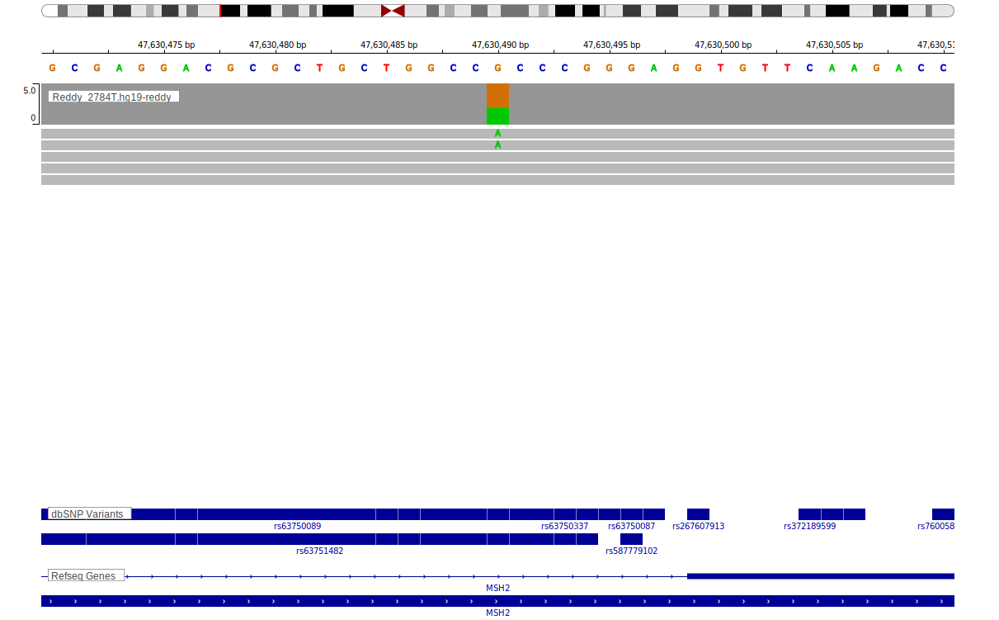

Average rating: ★ ★ ☆ ☆ ☆

::: {style="page-break-after: always;"}
:::

### MYB - fail (insufficient support)

Average rating: ★ ★ ☆ ☆ ☆

::: {style="page-break-after: always;"}
:::

### NCOR1 - fail (insufficient support)

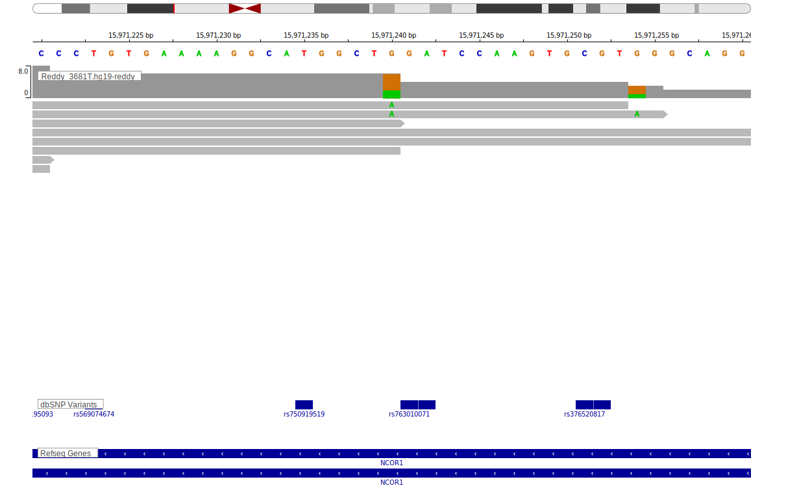

Average rating: ★ ★ ☆ ☆ ☆

::: {style="page-break-after: always;"}
:::

### NFKB2 - fail (insufficient support)

Average rating: ★ ★ ☆ ☆ ☆

::: {style="page-break-after: always;"}
:::

### PHF6 - fail (insufficient support)

Average rating: ★ ★ ☆ ☆ ☆

::: {style="page-break-after: always;"}
:::

### PTPRK - fail (insufficient support)

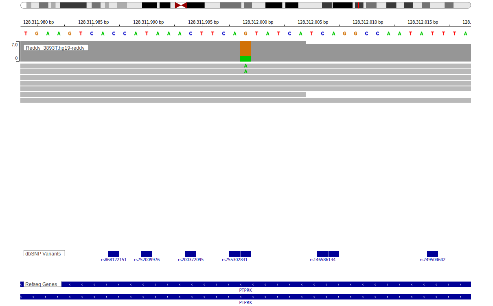

Average rating: ★ ★ ☆ ☆ ☆

::: {style="page-break-after: always;"}
:::

### RARA - fail (insufficient support)

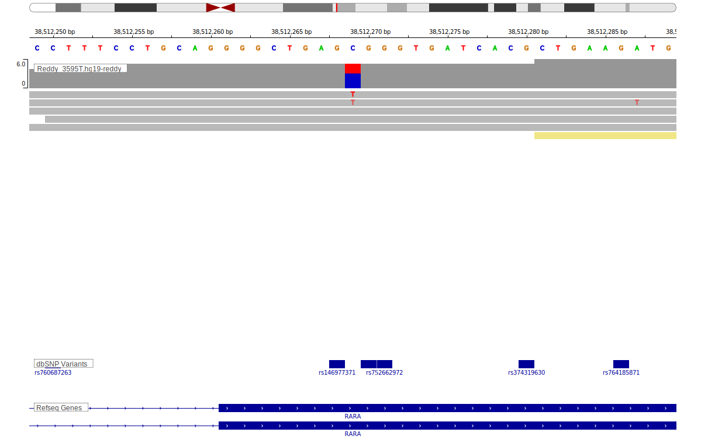

Average rating: ★ ☆ ☆ ☆ ☆

::: {style="page-break-after: always;"}
:::

### RUNX1 - fail (insufficient support)

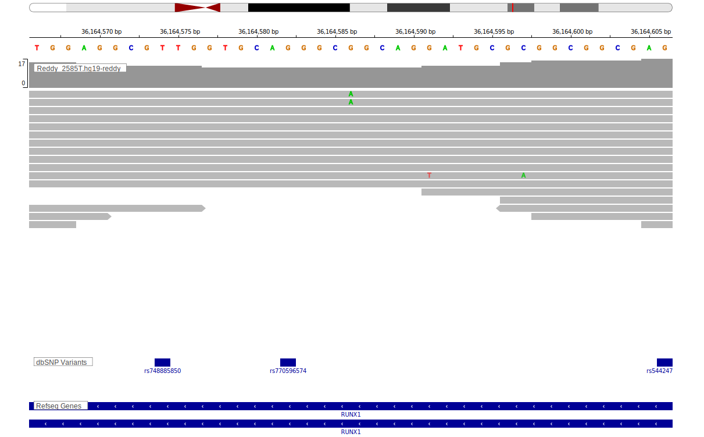

Average rating: ★ ★ ☆ ☆ ☆

::: {style="page-break-after: always;"}
:::

### SYK - fail (insufficient support)

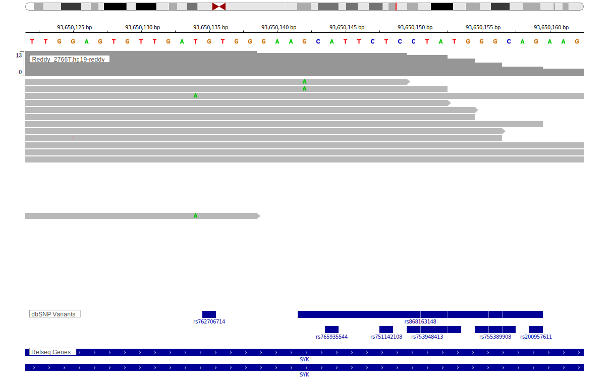

Average rating: ★ ★ ☆ ☆ ☆

::: {style="page-break-after: always;"}
:::

### WAC - fail (insufficient support)

Average rating: ★ ★ ☆ ☆ ☆

::: {style="page-break-after: always;"}
:::

### ZBTB7A - fail (insufficient support)

Average rating: ★ ☆ ☆ ☆ ☆

::: {style="page-break-after: always;"}
:::

### ZFAT - fail (insufficient support)

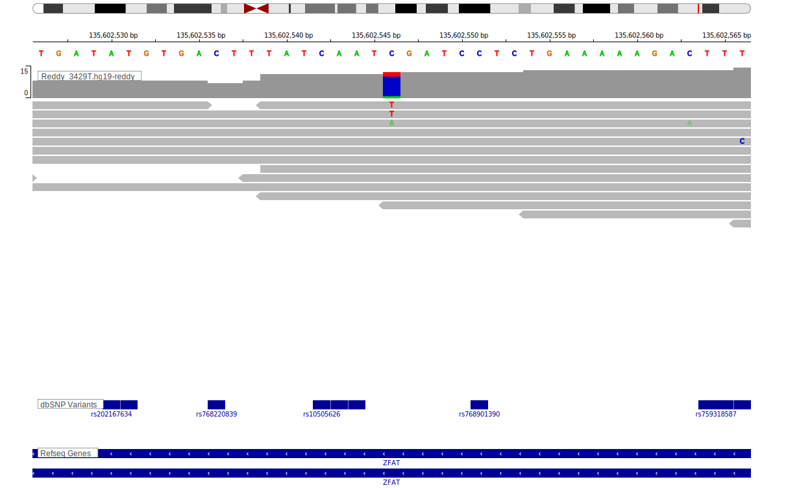

Average rating: ★ ★ ☆ ☆ ☆

::: {style="page-break-after: always;"}
:::

### [Morin *et al*, 2013](https://ashpublications.org/blood/article/122/7/1256/32425/Mutational-and-structural-analysis-of-diffuse) `<a name="morin">`{=html}`</a>`{=html}

   Methodology   Pairs   Unpaired tumors   Cell lines   Tier 1   Tier 2   Tier 3
  ------------- ------- ----------------- ------------ -------- -------- ---------
       WGS        40            0              13         9        23     7 (18%)

*See also:* [IGV
reports](https://www.bcgsc.ca/downloads/morinlab/GAMBL/Morin_2013/)

### HDAC7 - pass

Average rating: ★ ★ ★ ☆ ☆

::: {style="page-break-after: always;"}
:::

### FAM38B - fail (insufficient support)

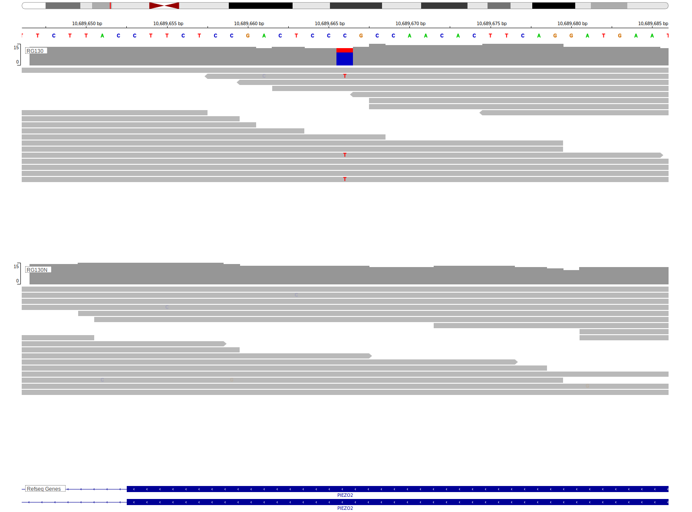

::: {style="page-break-after: always;"}
:::

### FNDC1 - fail (insufficient support)

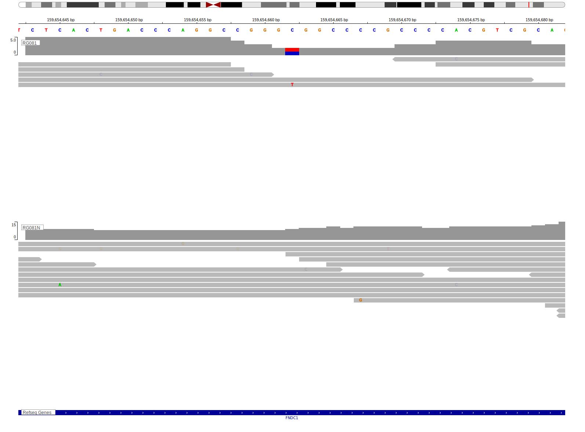

::: {style="page-break-after: always;"}
:::

### IER2 - fail (insufficient support)

::: {style="page-break-after: always;"}
:::

### PKD1 - fail (insufficient support)

::: {style="page-break-after: always;"}
:::

### POGZ - fail (insufficient support)

::: {style="page-break-after: always;"}
:::

### PTPN23 - fail (insufficient support)

::: {style="page-break-after: always;"}
:::

### SARM1 - fail (insufficient support)

::: {style="page-break-after: always;"}
:::

### Panea *et al*, 2019 `<a name="panea">`{=html}`</a>`{=html}

*See also:* [IGV
reports](https://www.bcgsc.ca/downloads/morinlab/GAMBL/Panea/)

   Methodology   Pairs   Unpaired tumors   Cell lines   Tier 1   Tier 2    Tier 3
  ------------- ------- ----------------- ------------ -------- -------- ----------
       WGS        101           0              0          2        15     22 (56%)

### CXCR4 - pass

### ALPK2 - fail (insufficient support)

::: {style="page-break-after: always;"}
:::

### CD79B - fail (insufficient support, RNA-only)

### CTCF - fail (insufficient support)

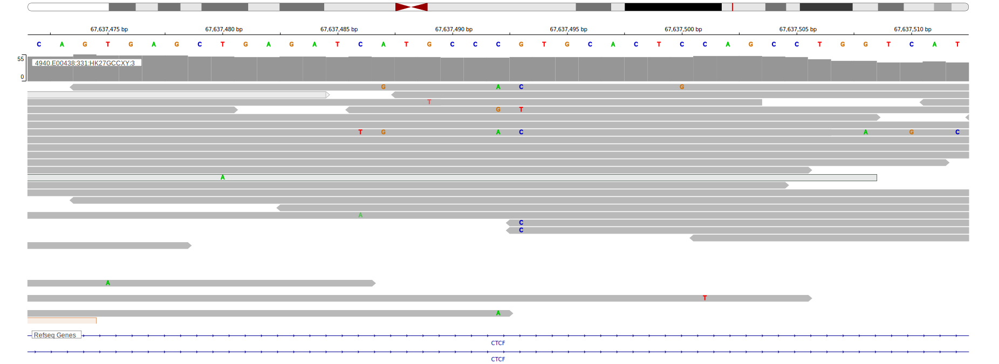

::: {style="page-break-after: always;"}
:::

### DNMT1 - fail (insufficient support)

### ETS1 - fail (insufficient support, RNA-only)

::: {style="page-break-after: always;"}
:::

### FZD3 - fail (insufficient support)

::: {style="page-break-after: always;"}
:::

### HIST1H1C - fail (insufficient support)

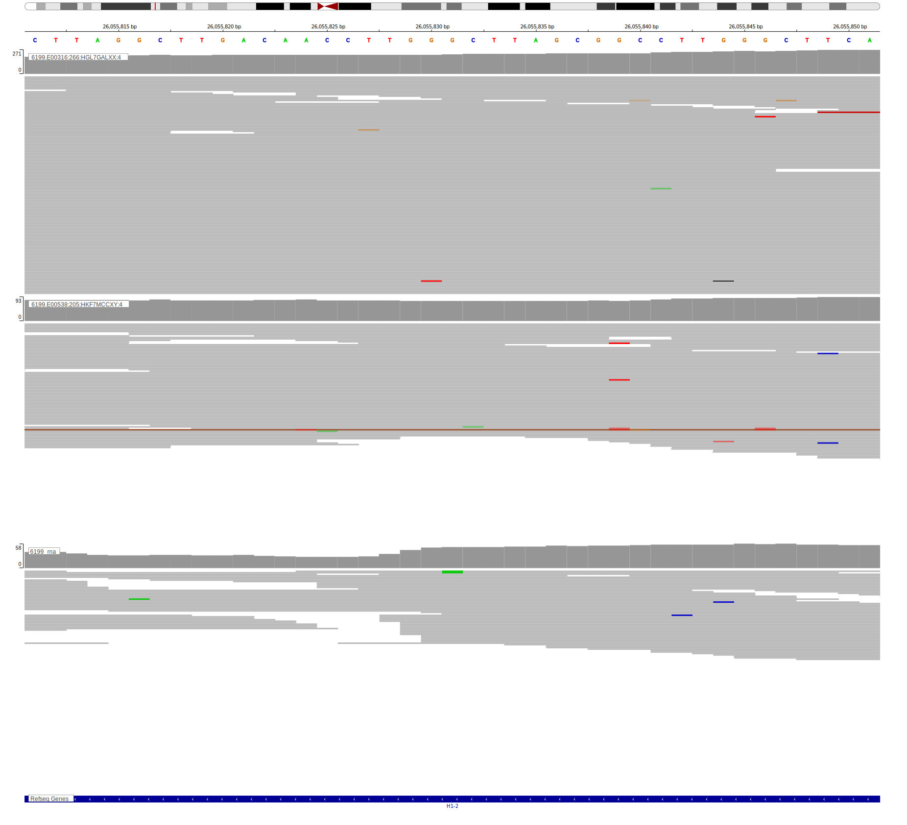

::: {style="page-break-after: always;"}
:::

### HIST1H2AG - fail (insufficient support)

### HIST1H2AM - fail (insufficient support, RNA-only)

::: {style="page-break-after: always;"}
:::

### HIST1H2BK - fail (insufficient support)

### HIST1H3H - fail (insufficient support)

::: {style="page-break-after: always;"}
:::

### HIST1H3J - fail (insufficient support)

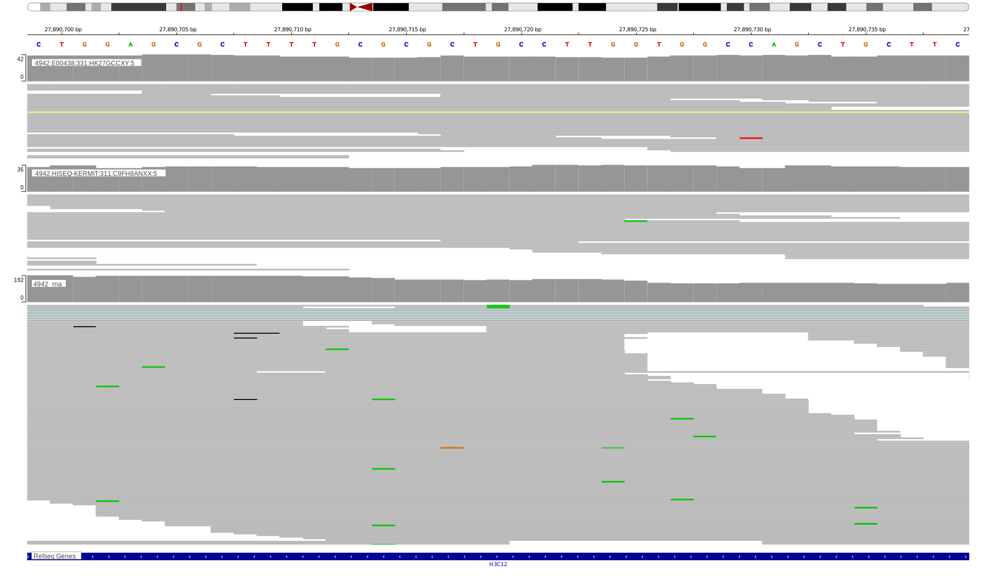

### KCNK10 - fail (insufficient support)

### MME - fail (insufficient support)

::: {style="page-break-after: always;"}
:::

### MTOR - fail (insufficient support)

### PABPC4L - fail (insufficient support)

### PCDHA11 - fail (insufficient support)

### PDZRN3 - fail (insufficient support)

::: {style="page-break-after: always;"}
:::

### PIK3R1 - fail (insufficient support)

### PXDNL - fail (insufficient support)

### SNTB2 - fail (insufficient support)

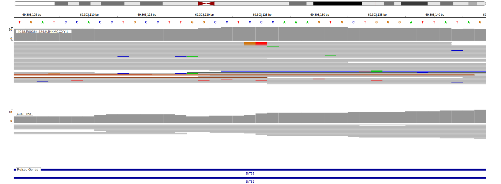

::: {style="page-break-after: always;"}
:::

### WDR7 - fail (insufficient support)

::: {style="page-break-after: always;"}
:::

### Chapuy *et al*, 2018 `<a name="chapuy">`{=html}`</a>`{=html}

*See also:* [IGV
reports](https://www.bcgsc.ca/downloads/morinlab/GAMBL/Chapuy_2018/)

   Methodology   Pairs   Unpaired tumors   Cell lines   Tier 1   Tier 2   Tier 3
  ------------- ------- ----------------- ------------ -------- -------- --------
      Exome       137          167             0          10       13     6(21%)

### DOCK1 - pass

::: {style="page-break-after: always;"}
:::

### FUT5 - fail (insufficient support)

::: {style="page-break-after: always;"}
:::

### NLRP8 - fail (insufficient support)

::: {style="page-break-after: always;"}
:::

### PDE4DIP - fail (insufficient support)

::: {style="page-break-after: always;"}
:::

### Hübschmann *et al*, 2021 `<a name="icgc">`{=html}`</a>`{=html}

*See also:* [IGV
reports](https://www.bcgsc.ca/downloads/morinlab/GAMBL/MALY/)

   Methodology   Pairs   Unpaired tumors   Cell lines   Tier 1   Tier 2    Tier 3
  ------------- ------- ----------------- ------------ -------- -------- ----------
       WGS        179           2              0          5        31     3 (7.7%)

### IKBKE - pass

::: {style="page-break-after: always;"}
:::

### GAK - fail (insufficient support)

::: {style="page-break-after: always;"}
:::

### HLA-DQA1 - fail (insufficient support)

::: {style="page-break-after: always;"}
:::

### NR2F2 - fail (insufficient support)

::: {style="page-break-after: always;"}
:::

## References {#references .unnumbered}

:::::::::::::::::::::::::::::::::::::::::::::::::::::::::::::: {#refs .references .csl-bib-body}
::: {#ref-albuquerqueEnhancingKnowledgeDiscovery2017 .csl-entry}
[1. ]{.csl-left-margin}[Albuquerque MA, Grande BM, Ritch EJ,
Pararajalingam P, Jessa S, Krzywinski M, Grewal JK, Shah SP, Boutros PC,
Morin RD. Enhancing knowledge discovery from cancer genomics data with
Galaxy. Gigascience. 2017 May 1;6(5):1--13. PMCID:
[PMC5437943](https://www.ncbi.nlm.nih.gov/pmc/articles/PMC5437943)]{.csl-right-inline}
:::

::: {#ref-arthurGenomewideDiscoverySomatic2018 .csl-entry}
[2. ]{.csl-left-margin}[Arthur SE, Jiang A, Grande BM, Alcaide M,
Cojocaru R, Rushton CK, Mottok A, Hilton LK, Lat PK, Zhao EY, Culibrk L,
Ennishi D, Jessa S, Chong L, Thomas N, Pararajalingam P, Meissner B,
Boyle M, Davidson J, Bushell KR, Lai D, Farinha P, Slack GW, Morin GB,
Shah S, Sen D, Jones SJM, Mungall AJ, Gascoyne RD, Audas TE, Unrau P,
Marra MA, Connors JM, Steidl C, Scott DW, Morin RD. Genome-wide
discovery of somatic regulatory variants in diffuse large
[B-cell]{.nocase} lymphoma. Nat Commun. 2018 Oct 1;9(1):4001. PMCID:
[PMC6167379](https://www.ncbi.nlm.nih.gov/pmc/articles/PMC6167379)]{.csl-right-inline}
:::

::: {#ref-bohleRoleEarlyBcell2013 .csl-entry}
[3. ]{.csl-left-margin}[Bohle V, Döring C, Hansmann M-L, Küppers R.
[Role of early [B-cell]{.nocase} factor 1 (EBF1) in Hodgkin
lymphoma](https://doi.org/10.1038/leu.2012.280). Leukemia. 2013
Mar;27(3):671--679. ]{.csl-right-inline}
:::

::: {#ref-chapuyMolecularSubtypesDiffuse2018 .csl-entry}
[4. ]{.csl-left-margin}[Chapuy B, Stewart C, Dunford AJ, Kim J, Kamburov
A, Redd RA, Lawrence MS, Roemer MGM, Li AJ, Ziepert M, Staiger AM, Wala
JA, Ducar MD, Leshchiner I, Rheinbay E, Taylor-Weiner A, Coughlin CA,
Hess JM, Pedamallu CS, Livitz D, Rosebrock D, Rosenberg M, Tracy AA,
Horn H, van Hummelen P, Feldman AL, Link BK, Novak AJ, Cerhan JR,
Habermann TM, Siebert R, Rosenwald A, Thorner AR, Meyerson ML, Golub TR,
Beroukhim R, Wulf GG, Ott G, Rodig SJ, Monti S, Neuberg DS, Loeffler M,
Pfreundschuh M, Trümper L, Getz G, Shipp MA. Molecular subtypes of
diffuse large B cell lymphoma are associated with distinct pathogenic
mechanisms and outcomes. Nat Med. 2018 May;24(5):679--690. PMCID:
[PMC6613387](https://www.ncbi.nlm.nih.gov/pmc/articles/PMC6613387)]{.csl-right-inline}
:::

::: {#ref-compagnoMutationsMultipleGenes2009 .csl-entry}
[5. ]{.csl-left-margin}[Compagno M, Lim WK, Grunn A, Nandula SV,
Brahmachary M, Shen Q, Bertoni F, Ponzoni M, Scandurra M, Califano A,
Bhagat G, Chadburn A, Dalla-Favera R, Pasqualucci L. Mutations of
multiple genes cause deregulation of [NF-kappaB]{.nocase} in diffuse
large [B-cell]{.nocase} lymphoma. Nature. 2009 Jun 4;459(7247):717--721.
PMCID:
[PMC2973325](https://www.ncbi.nlm.nih.gov/pmc/articles/PMC2973325)]{.csl-right-inline}
:::

::: {#ref-davisChronicActiveBcellreceptor2010 .csl-entry}
[6. ]{.csl-left-margin}[Davis RE, Ngo VN, Lenz G, Tolar P, Young RM,
Romesser PB, Kohlhammer H, Lamy L, Zhao H, Yang Y, Xu W, Shaffer AL,
Wright G, Xiao W, Powell J, Jiang JK, Thomas CJ, Rosenwald A, Ott G,
Müller-Hermelink HK, Gascoyne RD, Connors JM, Johnson NA, Rimsza LM,
Campo E, Jaffe ES, Wilson WH, Delabie J, Smeland EB, Fisher RI, Braziel
RM, Tubbs RR, Cook JR, Weisenburger DD, Chan WC, Pierce SK, Staudt LM.
Chronic active [B-cell-receptor]{.nocase} signalling in diffuse large
[B-cell]{.nocase} lymphoma. Nature. 2010 Jan;463(7277):88--92. PMCID:
[PMC2845535](https://www.ncbi.nlm.nih.gov/pmc/articles/PMC2845535)]{.csl-right-inline}
:::

::: {#ref-drevalGeneticSubdivisionsFollicular2023 .csl-entry}
[7. ]{.csl-left-margin}[Dreval K, Hilton LK, Cruz M, Shaalan H,
Ben-Neriah S, Boyle M, Collinge B, Coyle KM, Duns G, Farinha P, Grande
BM, Meissner B, Pararajalingam P, Rushton CK, Slack GW, Wong J, Mungall
AJ, Marra MA, Connors JM, Steidl C, Scott DW, Morin RD. Genetic
subdivisions of follicular lymphoma defined by distinct coding and
noncoding mutation patterns. Blood. 2023 Aug 10;142(6):561--573. PMCID:
[PMC10644066](https://www.ncbi.nlm.nih.gov/pmc/articles/PMC10644066)]{.csl-right-inline}
:::

::: {#ref-dunsCharacterizationDLBCLPMBL2021 .csl-entry}
[8. ]{.csl-left-margin}[Duns G, Viganò E, Ennishi D, Sarkozy C, Hung SS,
Chavez E, Takata K, Rushton C, Jiang A, Ben-Neriah S, Woolcock BW, Slack
GW, Hsi ED, Craig JW, Hilton LK, Shah SP, Farinha P, Mottok A, Gascoyne
RD, Morin RD, Savage KJ, Scott DW, Steidl C. [Characterization of DLBCL
with a PMBL gene expression
signature](https://doi.org/10.1182/blood.2020007683). Blood. 2021 Jul
15;138(2):136--148. ]{.csl-right-inline}
:::

::: {#ref-fanComprehensiveCharacterizationDriver2020 .csl-entry}
[9. ]{.csl-left-margin}[Fan Z, Pei R, Sha K, Chen L, Wang T, Lu Y.
Comprehensive characterization of driver genes in diffuse large B cell
lymphoma. Oncol Lett. 2020 Jul;20(1):382--390. PMCID:
[PMC7285964](https://www.ncbi.nlm.nih.gov/pmc/articles/PMC7285964)]{.csl-right-inline}
:::

::: {#ref-hubschmannMutationalMechanismsShaping2021 .csl-entry}
[10. ]{.csl-left-margin}[Hübschmann D, Kleinheinz K, Wagener R, Bernhart
SH, López C, Toprak UH, Sungalee S, Ishaque N, Kretzmer H, Kreuz M,
Waszak SM, Paramasivam N, Ammerpohl O, Aukema SM, Beekman R, Bergmann
AK, Bieg M, Binder H, Borkhardt A, Borst C, Brors B, Bruns P, Carrillo
de Santa Pau E, Claviez A, Doose G, Haake A, Karsch D, Haas S, Hansmann
ML, Hoell JI, Hovestadt V, Huang B, Hummel M, Jäger-Schmidt C,
Kerssemakers JNA, Korbel JO, Kube D, Lawerenz C, Lenze D, Martens JHA,
Ott G, Radlwimmer B, Reisinger E, Richter J, Rico D, Rosenstiel P,
Rosenwald A, Schillhabel M, Stilgenbauer S, Stadler PF, Martín-Subero
JI, Szczepanowski M, Warsow G, Weniger MA, Zapatka M, Valencia A,
Stunnenberg HG, Lichter P, Möller P, Loeffler M, Eils R, Klapper W,
Hoffmann S, Trümper L, ICGC MMML-Seq consortium, ICGC DE-Mining
consortium, BLUEPRINT consortium, Küppers R, Schlesner M, Siebert R.
Mutational mechanisms shaping the coding and noncoding genome of
germinal center derived [B-cell]{.nocase} lymphomas. Leukemia. 2021
Jul;35(7):2002--2016. PMCID:
[PMC8257491](https://www.ncbi.nlm.nih.gov/pmc/articles/PMC8257491)]{.csl-right-inline}
:::

::: {#ref-khodabakhshiRecurrentTargetsAberrant2012 .csl-entry}
[11. ]{.csl-left-margin}[Khodabakhshi AH, Morin RD, Fejes AP, Mungall
AJ, Mungall KL, Bolger-Munro M, Johnson NA, Connors JM, Gascoyne RD,
Marra MA, Birol I, Jones SJM. Recurrent targets of aberrant somatic
hypermutation in lymphoma. Oncotarget. 2012;3(11):1308--1319. PMCID:
[PMC3717795](https://www.ncbi.nlm.nih.gov/pmc/articles/PMC3717795)]{.csl-right-inline}
:::

::: {#ref-kwanhianMicroRNA142Mutated202012 .csl-entry}
[12. ]{.csl-left-margin}[Kwanhian W, Lenze D, Alles J, Motsch N, Barth
S, Döll C, Imig J, Hummel M, Tinguely M, Trivedi P, Lulitanond V,
Meister G, Renner C, Grässer FA. MicroRNA-142 is mutated in about 20% of
diffuse large [B-cell]{.nocase} lymphoma. Cancer Med. 2012
Oct;1(2):141--155. PMCID:
[PMC3544448](https://www.ncbi.nlm.nih.gov/pmc/articles/PMC3544448)]{.csl-right-inline}
:::

::: {#ref-lenzOncogenicCARD11Mutations2008 .csl-entry}
[13. ]{.csl-left-margin}[Lenz G, Davis RE, Ngo VN, Lam L, George TC,
Wright GW, Dave SS, Zhao H, Xu W, Rosenwald A, Ott G, Müller-Hermelink
HK, Gascoyne RD, Connors JM, Rimsza LM, Campo E, Jaffe ES, Delabie J,
Smeland EB, Fisher RI, Chan WC, Staudt LM. [Oncogenic CARD11 mutations
in human diffuse large B cell
lymphoma.](https://doi.org/10.1126/science.1153629) Science. 2008
Mar;319(5870):1676--1679. ]{.csl-right-inline}
:::

::: {#ref-lohrDiscoveryPrioritizationSomatic2012 .csl-entry}
[14. ]{.csl-left-margin}[Lohr JG, Stojanov P, Lawrence MS, Auclair D,
Chapuy B, Sougnez C, Cruz-Gordillo P, Knoechel B, Asmann YW, Slager SL,
Novak AJ, Dogan A, Ansell SM, Link BK, Zou L, Gould J, Saksena G,
Stransky N, Rangel-Escareño C, Fernandez-Lopez JC, Hidalgo-Miranda A,
Melendez-Zajgla J, Hernández-Lemus E, Schwarz-Cruz y Celis A,
Imaz-Rosshandler I, Ojesina AI, Jung J, Pedamallu CS, Lander ES,
Habermann TM, Cerhan JR, Shipp MA, Getz G, Golub TR. Discovery and
prioritization of somatic mutations in diffuse large [B-cell]{.nocase}
lymphoma (DLBCL) by whole-exome sequencing. Proc Natl Acad Sci U S A.
2012 Mar 6;109(10):3879--3884. PMCID:
[PMC3309757](https://www.ncbi.nlm.nih.gov/pmc/articles/PMC3309757)]{.csl-right-inline}
:::

::: {#ref-mareschalWholeExomeSequencing2016 .csl-entry}
[15. ]{.csl-left-margin}[Mareschal S, Dubois S, Viailly PJ, Bertrand P,
Bohers E, Maingonnat C, Jaïs JP, Tesson B, Ruminy P, Peyrouze P,
Copie-Bergman C, Fest T, Jo Molina T, Haioun C, Salles G, Tilly H,
Lecroq T, Leroy K, Jardin F. [Whole exome sequencing of
relapsed/refractory patients expands the repertoire of somatic mutations
in diffuse large [B-cell]{.nocase}
lymphoma](https://doi.org/10.1002/gcc.22328). Genes Chromosomes Cancer.
2016 Mar;55(3):251--267. ]{.csl-right-inline}
:::

::: {#ref-morinFrequentMutationHistonemodifying2011 .csl-entry}
[16. ]{.csl-left-margin}[Morin RD, Mendez-Lago M, Mungall AJ, Goya R,
Mungall KL, Corbett RD, Johnson NA, Severson TM, Chiu R, Field M,
Jackman S, Krzywinski M, Scott DW, Trinh DL, Tamura-Wells J, Li S, Firme
MR, Rogic S, Griffith M, Chan S, Yakovenko O, Meyer IM, Zhao EY, Smailus
D, Moksa M, Chittaranjan S, Rimsza L, Brooks-Wilson A, Spinelli JJ,
Ben-Neriah S, Meissner B, Woolcock B, Boyle M, McDonald H, Tam A, Zhao
Y, Delaney A, Zeng T, Tse K, Butterfield Y, Birol I, Holt R, Schein J,
Horsman DE, Moore R, Jones SJM, Connors JM, Hirst M, Gascoyne RD, Marra
MA. Frequent mutation of histone-modifying genes in non-Hodgkin
lymphoma. Nature. 2011 Jul 27;476(7360):298--303. PMCID:
[PMC3210554](https://www.ncbi.nlm.nih.gov/pmc/articles/PMC3210554)]{.csl-right-inline}
:::

::: {#ref-morinGeneticLandscapesRelapsed2016 .csl-entry}
[17. ]{.csl-left-margin}[Morin RD, Assouline S, Alcaide M, Mohajeri A,
Johnston RL, Chong L, Grewal J, Yu S, Fornika D, Bushell K, Nielsen TH,
Petrogiannis-Haliotis T, Crump M, Tosikyan A, Grande BM, MacDonald D,
Rousseau C, Bayat M, Sesques P, Froment R, Albuquerque M, Monczak Y,
Oros KK, Greenwood C, Riazalhosseini Y, Arseneault M, Camlioglu E,
Constantin A, Pan-Hammarstrom Q, Peng R, Mann KK, Johnson NA. [Genetic
Landscapes of Relapsed and Refractory Diffuse Large B-Cell
Lymphomas](https://doi.org/10.1158/1078-0432.CCR-15-2123). Clin Cancer
Res. 2016 May 1;22(9):2290--2300. ]{.csl-right-inline}
:::

::: {#ref-morinMutationalStructuralAnalysis2013 .csl-entry}
[18. ]{.csl-left-margin}[Morin RD, Mungall K, Pleasance E, Mungall AJ,
Goya R, Huff RD, Scott DW, Ding J, Roth A, Chiu R, Corbett RD, Chan FC,
Mendez-Lago M, Trinh DL, Bolger-Munro M, Taylor G, Hadj Khodabakhshi A,
Ben-Neriah S, Pon J, Meissner B, Woolcock B, Farnoud N, Rogic S, Lim EL,
Johnson NA, Shah S, Jones S, Steidl C, Holt R, Birol I, Moore R, Connors
JM, Gascoyne RD, Marra MA. Mutational and structural analysis of diffuse
large [B-cell]{.nocase} lymphoma using whole-genome sequencing. Blood.
2013 Aug 15;122(7):1256--1265. PMCID:
[PMC3744992](https://www.ncbi.nlm.nih.gov/pmc/articles/PMC3744992)]{.csl-right-inline}
:::

::: {#ref-morinSomaticMutationsAltering2010 .csl-entry}
[19. ]{.csl-left-margin}[Morin RD, Johnson NA, Severson TM, Mungall AJ,
An J, Goya R, Paul JE, Boyle M, Woolcock BW, Kuchenbauer F, Yap D,
Humphries RK, Griffith OL, Shah S, Zhu H, Kimbara M, Shashkin P, Charlot
JF, Tcherpakov M, Corbett R, Tam A, Varhol R, Smailus D, Moksa M, Zhao
Y, Delaney A, Qian H, Birol I, Schein J, Moore R, Holt R, Horsman DE,
Connors JM, Jones S, Aparicio S, Hirst M, Gascoyne RD, Marra MA. Somatic
mutations altering EZH2 (Tyr641) in follicular and diffuse large
[B-cell]{.nocase} lymphomas of germinal-center origin. Nat Genet. 2010
Feb;42(2):181--185. PMCID:
[PMC2850970](https://www.ncbi.nlm.nih.gov/pmc/articles/PMC2850970)]{.csl-right-inline}
:::

::: {#ref-ngoOncogenicallyActiveMYD882011 .csl-entry}
[20. ]{.csl-left-margin}[Ngo VN, Young RM, Schmitz R, Jhavar S, Xiao W,
Lim KH, Kohlhammer H, Xu W, Yang Y, Zhao H, Shaffer AL, Romesser P,
Wright G, Powell J, Rosenwald A, Muller-Hermelink HK, Ott G, Gascoyne
RD, Connors JM, Rimsza LM, Campo E, Jaffe ES, Delabie J, Smeland EB,
Fisher RI, Braziel RM, Tubbs RR, Cook JR, Weisenburger DD, Chan WC,
Staudt LM. Oncogenically active MYD88 mutations in human lymphoma.
Nature. 2011 Feb 3;470(7332):115--119. PMCID:
[PMC5024568](https://www.ncbi.nlm.nih.gov/pmc/articles/PMC5024568)]{.csl-right-inline}
:::

::: {#ref-novakWholeexomeAnalysisReveals2015 .csl-entry}
[21. ]{.csl-left-margin}[Novak AJ, Asmann YW, Maurer MJ, Wang C, Slager
SL, Hodge LS, Manske M, Price-Troska T, Yang Z-Z, Zimmermann MT,
Nowakowski GS, Ansell SM, Witzig TE, McPhail E, Ketterling R, Feldman
AL, Dogan A, Link BK, Habermann TM, Cerhan JR. Whole-exome analysis
reveals novel somatic genomic alterations associated with outcome in
immunochemotherapy-treated diffuse large B-cell lymphoma. Blood Cancer
Journal \[Internet\]. 2015 Aug \[cited 2024 Nov 15\];5(8):e346--e346.
Available from:
<https://www.nature.com/articles/bcj201569>]{.csl-right-inline}
:::

::: {#ref-okosunRecurrentMTORC1activatingRRAGC2016 .csl-entry}
[22. ]{.csl-left-margin}[Okosun J, Wolfson RL, Wang J, Araf S, Wilkins
L, Castellano BM, Escudero-Ibarz L, Al Seraihi AF, Richter J, Bernhart
SH, Efeyan A, Iqbal S, Matthews J, Clear A, Guerra-Assunção JA, Bödör C,
Quentmeier H, Mansbridge C, Johnson P, Davies A, Strefford JC, Packham
G, Barrans S, Jack A, Du MQ, Calaminici M, Lister TA, Auer R, Montoto S,
Gribben JG, Siebert R, Chelala C, Zoncu R, Sabatini DM, Fitzgibbon J.
Recurrent [mTORC1-activating RRAGC]{.nocase} mutations in follicular
lymphoma. Nat Genet. 2016 Feb;48(2):183--188. PMCID:
[PMC4731318](https://www.ncbi.nlm.nih.gov/pmc/articles/PMC4731318)]{.csl-right-inline}
:::

::: {#ref-pararajalingamCodingNoncodingDrivers2020 .csl-entry}
[23. ]{.csl-left-margin}[Pararajalingam P, Coyle KM, Arthur SE, Thomas
N, Alcaide M, Meissner B, Boyle M, Qureshi Q, Grande BM, Rushton C,
Slack GW, Mungall AJ, Tam CS, Agarwal R, Dawson SJ, Lenz G,
Balasubramanian S, Gascoyne RD, Steidl C, Connors J, Villa D, Audas TE,
Marra MA, Johnson NA, Scott DW, Morin RD. Coding and noncoding drivers
of mantle cell lymphoma identified through exome and genome sequencing.
Blood. 2020 Jul 30;136(5):572--584. PMCID:
[PMC7440974](https://www.ncbi.nlm.nih.gov/pmc/articles/PMC7440974)]{.csl-right-inline}
:::

::: {#ref-pasqualucciAnalysisCodingGenome2011 .csl-entry}
[24. ]{.csl-left-margin}[Pasqualucci L, Trifonov V, Fabbri G, Ma J,
Rossi D, Chiarenza A, Wells VA, Grunn A, Messina M, Elliot O, Chan J,
Bhagat G, Chadburn A, Gaidano G, Mullighan CG, Rabadan R, Dalla-Favera
R. Analysis of the coding genome of diffuse large [B-cell]{.nocase}
lymphoma. Nat Genet. 2011 Jul 31;43(9):830--837. PMCID:
[PMC3297422](https://www.ncbi.nlm.nih.gov/pmc/articles/PMC3297422)]{.csl-right-inline}
:::

::: {#ref-pasqualucciHypermutationMultipleProtooncogenes2001 .csl-entry}
[25. ]{.csl-left-margin}[Pasqualucci L, Neumeister P, Goossens T,
Nanjangud G, Chaganti RS, Küppers R, Dalla-Favera R. [Hypermutation of
multiple proto-oncogenes in [B-cell]{.nocase} diffuse large-cell
lymphomas](https://doi.org/10.1038/35085588). Nature. 2001 Jul
19;412(6844):341--346. ]{.csl-right-inline}
:::

::: {#ref-pasqualucciInactivatingMutationsAcetyltransferase2011 .csl-entry}
[26. ]{.csl-left-margin}[Pasqualucci L, Dominguez-Sola D, Chiarenza A,
Fabbri G, Grunn A, Trifonov V, Kasper LH, Lerach S, Tang H, Ma J, Rossi
D, Chadburn A, Murty VV, Mullighan CG, Gaidano G, Rabadan R, Brindle PK,
Dalla-Favera R. Inactivating mutations of acetyltransferase genes in
[B-cell]{.nocase} lymphoma. Nature. 2011 Mar 10;471(7337):189--195.
PMCID:
[PMC3271441](https://www.ncbi.nlm.nih.gov/pmc/articles/PMC3271441)]{.csl-right-inline}
:::

::: {#ref-pasqualucciInactivationPRDM1BLIMP12006 .csl-entry}
[27. ]{.csl-left-margin}[Pasqualucci L, Compagno M, Houldsworth J, Monti
S, Grunn A, Nandula SV, Aster JC, Murty VV, Shipp MA, Dalla-Favera R.
Inactivation of the PRDM1/BLIMP1 gene in diffuse large B cell lymphoma.
J Exp Med. 2006 Feb;203(2):311--317. ]{.csl-right-inline}
:::

::: {#ref-reddyGeneticFunctionalDrivers2017 .csl-entry}
[28. ]{.csl-left-margin}[Reddy A, Zhang J, Davis NS, Moffitt AB, Love
CL, Waldrop A, Leppa S, Pasanen A, Meriranta L, Karjalainen-Lindsberg
ML, Nørgaard P, Pedersen M, Gang AO, Høgdall E, Heavican TB, Lone W,
Iqbal J, Qin Q, Li G, Kim SY, Healy J, Richards KL, Fedoriw Y,
Bernal-Mizrachi L, Koff JL, Staton AD, Flowers CR, Paltiel O,
Goldschmidt N, Calaminici M, Clear A, Gribben J, Nguyen E, Czader MB,
Ondrejka SL, Collie A, Hsi ED, Tse E, Au-Yeung RKH, Kwong YL, Srivastava
G, Choi WWL, Evens AM, Pilichowska M, Sengar M, Reddy N, Li S, Chadburn
A, Gordon LI, Jaffe ES, Levy S, Rempel R, Tzeng T, Happ LE, Dave T,
Rajagopalan D, Datta J, Dunson DB, Dave SS. Genetic and Functional
Drivers of Diffuse Large B Cell Lymphoma. Cell. 2017
Oct;171(2):481--494.e15. PMCID:
[PMC5659841](https://www.ncbi.nlm.nih.gov/pmc/articles/PMC5659841)]{.csl-right-inline}
:::

::: {#ref-rushtonGeneticEvolutionaryPatterns2020 .csl-entry}
[29. ]{.csl-left-margin}[Rushton CK, Arthur SE, Alcaide M, Cheung M,
Jiang A, Coyle KM, Cleary KLS, Thomas N, Hilton LK, Michaud N, Daigle S,
Davidson J, Bushell K, Yu S, Rys RN, Jain M, Shepherd L, Marra MA,
Kuruvilla J, Crump M, Mann K, Assouline S, Connors JM, Steidl C, Cragg
MS, Scott DW, Johnson NA, Morin RD. Genetic and evolutionary patterns of
treatment resistance in relapsed [B-cell]{.nocase} lymphoma. Blood Adv.
2020 Jul 14;4(13):2886--2898. PMCID:
[PMC7362366](https://www.ncbi.nlm.nih.gov/pmc/articles/PMC7362366)]{.csl-right-inline}
:::

::: {#ref-schmitzGeneticsPathogenesisDiffuse2018 .csl-entry}
[30. ]{.csl-left-margin}[Schmitz R, Wright GW, Huang DW, Johnson CA,
Phelan JD, Wang JQ, Roulland S, Kasbekar M, Young RM, Shaffer AL, Hodson
DJ, Xiao W, Yu X, Yang Y, Zhao H, Xu W, Liu X, Zhou B, Du W, Chan WC,
Jaffe ES, Gascoyne RD, Connors JM, Campo E, Lopez-Guillermo A, Rosenwald
A, Ott G, Delabie J, Rimsza LM, Tay Kuang Wei K, Zelenetz AD, Leonard
JP, Bartlett NL, Tran B, Shetty J, Zhao Y, Soppet DR, Pittaluga S,
Wilson WH, Staudt LM. Genetics and Pathogenesis of Diffuse Large B-Cell
Lymphoma. N Engl J Med. 2018 Apr 12;378(15):1396--1407. PMCID:
[PMC6010183](https://www.ncbi.nlm.nih.gov/pmc/articles/PMC6010183)]{.csl-right-inline}
:::

::: {#ref-schollMutationsRegionFAS2007 .csl-entry}
[31. ]{.csl-left-margin}[Scholl V, Stefanoff CG, Hassan R, Spector N,
Renault IZ. [Mutations within the 5' region of FAS/CD95 gene in nodal
diffuse large [B-cell]{.nocase}
lymphoma](https://doi.org/10.1080/10428190701230858). Leuk Lymphoma.
2007 May;48(5):957--963. ]{.csl-right-inline}
:::

::: {#ref-shinBRAFV600EMAP2K12015 .csl-entry}
[32. ]{.csl-left-margin}[Shin SY, Lee ST, Kim HJ, Ki CS, Jung CW, Kim
JW, Kim SH. BRAF V600E and MAP2K1 mutations in hairy cell leukemia and
splenic marginal zone lymphoma cases. Ann Lab Med. 2015
Mar;35(2):257--259. PMCID:
[PMC4330180](https://www.ncbi.nlm.nih.gov/pmc/articles/PMC4330180)]{.csl-right-inline}
:::

::: {#ref-tanakaFrequentIncidenceSomatic1992 .csl-entry}
[33. ]{.csl-left-margin}[Tanaka S, Louie DC, Kant JA, Reed JC. [Frequent
incidence of somatic mutations in translocated BCL2 oncogenes of
non-Hodgkin's lymphomas](https://doi.org/10.1182/blood.V79.1.229.229).
Blood. 1992 Jan 1;79(1):229--237. ]{.csl-right-inline}
:::

::: {#ref-thomasMutationalAnalysisIkappaBalpha2004 .csl-entry}
[34. ]{.csl-left-margin}[Thomas RK, Wickenhauser C, Tawadros S, Diehl V,
Küppers R, Wolf J, Schmitz R. [Mutational analysis of the IkappaBalpha
gene in activated B cell-like diffuse large [B-cell]{.nocase}
lymphoma](https://doi.org/10.1111/j.1365-2141.2004.05000.x). Br J
Haematol. 2004 Jul;126(1):50--54. ]{.csl-right-inline}
:::

::: {#ref-tiacciBRAFMutationsHairycell2011 .csl-entry}
[35. ]{.csl-left-margin}[Tiacci E, Trifonov V, Schiavoni G, Holmes A,
Kern W, Martelli MP, Pucciarini A, Bigerna B, Pacini R, Wells VA,
Sportoletti P, Pettirossi V, Mannucci R, Elliott O, Liso A, Ambrosetti
A, Pulsoni A, Forconi F, Trentin L, Semenzato G, Inghirami G, Capponi M,
Di Raimondo F, Patti C, Arcaini L, Musto P, Pileri S, Haferlach C,
Schnittger S, Pizzolo G, Foà R, Farinelli L, Haferlach T, Pasqualucci L,
Rabadan R, Falini B. BRAF mutations in hairy-cell leukemia. N Engl J
Med. 2011 Jun 16;364(24):2305--2315. PMCID:
[PMC3689585](https://www.ncbi.nlm.nih.gov/pmc/articles/PMC3689585)]{.csl-right-inline}
:::

::: {#ref-yildizActivatingSTAT6Mutations2015 .csl-entry}
[36. ]{.csl-left-margin}[Yildiz M, Li H, Bernard D, Amin NA, Ouillette
P, Jones S, Saiya-Cork K, Parkin B, Jacobi K, Shedden K, Wang S, Chang
AE, Kaminski MS, Malek SN. Activating STAT6 mutations in follicular
lymphoma. Blood. 2015 Jan 22;125(4):668--679. PMCID:
[PMC4729538](https://www.ncbi.nlm.nih.gov/pmc/articles/PMC4729538)]{.csl-right-inline}
:::

::: {#ref-zhangGeneticHeterogeneityDiffuse2013 .csl-entry}
[37. ]{.csl-left-margin}[Zhang J, Grubor V, Love CL, Banerjee A,
Richards KL, Mieczkowski PA, Dunphy C, Choi W, Au WY, Srivastava G,
Lugar PL, Rizzieri DA, Lagoo AS, Bernal-Mizrachi L, Mann KP, Flowers C,
Naresh K, Evens A, Gordon LI, Czader M, Gill JI, Hsi ED, Liu Q, Fan A,
Walsh K, Jima D, Smith LL, Johnson AJ, Byrd JC, Luftig MA, Ni T, Zhu J,
Chadburn A, Levy S, Dunson D, Dave SS. Genetic heterogeneity of diffuse
large [B-cell]{.nocase} lymphoma. Proceedings of the National Academy of
Sciences of the United States of America. 2013;110:1398--1403. PMCID:
[PMC3557051](https://www.ncbi.nlm.nih.gov/pmc/articles/PMC3557051)]{.csl-right-inline}
:::

::: {#ref-barariaCathepsinAlterationsInduce2020 .csl-entry}
[38. ]{.csl-left-margin}[Bararia D, Hildebrand JA, Stolz S, Haebe S,
Alig S, Trevisani CP, Osorio-Barrios F, Bartoschek MD, Mentz M, Pastore
A, Gaitzsch E, Heide M, Jurinovic V, Rautter K, Gunawardana J, Sabdia
MB, Szczepanowski M, Richter J, Klapper W, Louissaint A, Ludwig C,
Bultmann S, Leonhardt H, Eustermann S, Hopfner KP, Hiddemann W, von
Bergwelt-Baildon M, Steidl C, Kridel R, Tobin JWD, Gandhi MK, Weinstock
DM, Schmidt-Supprian M, Sárosi MB, Rudelius M, Passerini V, Mautner J,
Weigert O. [Cathepsin S Alterations Induce a Tumor-Promoting Immune
Microenvironment in Follicular
Lymphoma](https://doi.org/10.1016/j.celrep.2020.107522). Cell Rep. 2020
May 5;31(5):107522. ]{.csl-right-inline}
:::

::: {#ref-cheungAcquiredTNFRSF14Mutations2010 .csl-entry}
[39. ]{.csl-left-margin}[Cheung KJJ, Johnson NA, Affleck JG, Severson T,
Steidl C, Ben-Neriah S, Schein J, Morin RD, Moore R, Shah SP, Qian H,
Paul JE, Telenius A, Relander T, Lam W, Savage K, Connors JM, Brown C,
Marra MA, Gascoyne RD, Horsman DE. [Acquired TNFRSF14 mutations in
follicular lymphoma are associated with worse
prognosis](https://doi.org/10.1158/0008-5472.CAN-10-2460). Cancer Res.
2010 Nov 15;70(22):9166--9174. ]{.csl-right-inline}
:::

::: {#ref-krysiakRecurrentSomaticMutations2017 .csl-entry}
[40. ]{.csl-left-margin}[Krysiak K, Gomez F, White BS, Matlock M, Miller
CA, Trani L, Fronick CC, Fulton RS, Kreisel F, Cashen AF, Carson KR,
Berrien-Elliott MM, Bartlett NL, Griffith M, Griffith OL, Fehniger TA.
Recurrent somatic mutations affecting [B-cell]{.nocase} receptor
signaling pathway genes in follicular lymphoma. Blood. 2017 Jan
26;129(4):473--483. PMCID:
[PMC5270390](https://www.ncbi.nlm.nih.gov/pmc/articles/PMC5270390)]{.csl-right-inline}
:::

::: {#ref-laurentFollicularLymphomaComprises2024 .csl-entry}
[41. ]{.csl-left-margin}[Laurent C, Trisal P, Tesson B, Seth S, Beyou A,
Roulland S, Lesne B, Van Acker N, Cerapio JP, Chartier L, Guille A,
Stokes M, Huang C, Huet S, Gandhi A, Morschauser F, Xerri L. Follicular
lymphoma comprises germinal center-like and memory-like molecular
subtypes with prognostic significance. Blood. 2024 Oct;
]{.csl-right-inline}
:::

::: {#ref-louissaintPediatrictypeNodalFollicular2016 .csl-entry}
[42. ]{.csl-left-margin}[Louissaint A, Schafernak KT, Geyer JT, Kovach
AE, Ghandi M, Gratzinger D, Roth CG, Paxton CN, Kim S, Namgyal C, Morin
R, Morgan EA, Neuberg DS, South ST, Harris MH, Hasserjian RP, Hochberg
EP, Garraway LA, Harris NL, Weinstock DM. Pediatric-type nodal
follicular lymphoma: A biologically distinct lymphoma with frequent MAPK
pathway mutations. Blood. 2016 Aug 25;128(8):1093--1100. PMCID:
[PMC5000844](https://www.ncbi.nlm.nih.gov/pmc/articles/PMC5000844)]{.csl-right-inline}
:::

::: {#ref-maSubtypespecificCooccurringGenetic2022 .csl-entry}
[43. ]{.csl-left-margin}[Ma MCJ, Tadros S, Bouska A, Heavican T, Yang H,
Deng Q, Moore D, Akhter A, Hartert K, Jain N, Showell J, Ghosh S, Street
L, Davidson M, Carey C, Tobin J, Perumal D, Vose JM, Lunning MA, Sohani
AR, Chen BJ, Buckley S, Nastoupil LJ, Davis RE, Westin JR, Fowler NH,
Parekh S, Gandhi M, Neelapu S, Stewart D, Bhalla K, Iqbal J, Greiner T,
Rodig SJ, Mansoor A, Green MR. Subtype-specific and co-occurring genetic
alterations in B-cell non-Hodgkin lymphoma. Haematologica. 2022
Mar;107(3):690--701. PMCID:
[PMC8883549](https://www.ncbi.nlm.nih.gov/pmc/articles/PMC8883549)]{.csl-right-inline}
:::

::: {#ref-rossiAberrantSomaticHypermutation2006 .csl-entry}
[44. ]{.csl-left-margin}[Rossi D, Berra E, Cerri M, Deambrogi C,
Barbieri C, Franceschetti S, Lunghi M, Conconi A, Paulli M, Matolcsy A,
Pasqualucci L, Capello D, Gaidano G. Aberrant somatic hypermutation in
transformation of follicular lymphoma and chronic lymphocytic leukemia
to diffuse large B-cell lymphoma. Haematologica. 2006
Oct;91(10):1405--1409. PMID:
[17018394](https://www.ncbi.nlm.nih.gov/pubmed/17018394)]{.csl-right-inline}
:::

::: {#ref-russler-germainMutationsAssociatedProgression2023 .csl-entry}
[45. ]{.csl-left-margin}[Russler-Germain DA, Krysiak K, Ramirez CA,
Mosior M, Watkins MP, Gomez F, Skidmore ZL, Trani L, Gao F, Geyer S,
Cashen A, Mehta-Shah N, Kahl B, Bartlett N, Alderuccio J, Lossos I,
Ondrejka S, Hsi E, Martin P, Leonard J, Griffith M, Griffith O, Fehniger
T. [Mutations associated with progression in follicular lymphoma predict
inferior outcomes at diagnosis: Alliance
A151303](https://doi.org/10.1182/bloodadvances.2023010779). Blood
Advances. 2023;7:5524--5539. ]{.csl-right-inline}
:::

::: {#ref-abateDistinctViralMutational2015 .csl-entry}
[46. ]{.csl-left-margin}[Abate F, Ambrosio M, Mundo L, Laginestra M,
Fuligni F, Rossi M, Zairis S, Gazaneo S, Falco GD, Lazzi S, Bellan C,
Rocca BJ, Amato T, Marasco E, Etebari M, Ogwang M, Calbi V, Ndede I,
Patel K, Chumba D, Piccaluga P, Pileri S, Leoncini L, Rabadán R.
[Distinct Viral and Mutational Spectrum of Endemic Burkitt
Lymphoma](https://doi.org/10.1371/journal.ppat.1005158). PLoS Pathogens.
2015;11. ]{.csl-right-inline}
:::

::: {#ref-burkhardtClinicalRelevanceMolecular2022 .csl-entry}
[47. ]{.csl-left-margin}[Burkhardt B, Michgehl U, Rohde J, Erdmann T,
Berning P, Reutter K, Rohde M, Borkhardt A, Burmeister T, Dave S,
Tzankov A, Dugas M, Sandmann S, Fend F, Finger J, Mueller S, Gökbuget N,
Haferlach T, Kern W, Hartmann W, Klapper W, Oschlies I, Richter J,
Kontny U, Lutz M, Maecker-Kolhoff B, Ott G, Rosenwald A, Siebert R, von
Stackelberg A, Strahm B, Woessmann W, Zimmermann M, Zapukhlyak M, Grau
M, Lenz G. Clinical relevance of molecular characteristics in Burkitt
lymphoma differs according to age. Nat Commun. 2022 Jul 6;13(1):3881.
PMCID:
[PMC9259584](https://www.ncbi.nlm.nih.gov/pmc/articles/PMC9259584)]{.csl-right-inline}
:::

::: {#ref-grandeGenomewideDiscoverySomatic2019 .csl-entry}
[48. ]{.csl-left-margin}[Grande BM, Gerhard DS, Jiang A, Griner NB,
Abramson JS, Alexander TB, Allen H, Ayers LW, Bethony JM, Bhatia K,
Bowen J, Casper C, Choi JK, Culibrk L, Davidsen TM, Dyer MA,
Gastier-Foster JM, Gesuwan P, Greiner TC, Gross TG, Hanf B, Harris NL,
He Y, Irvin JD, Jaffe ES, Jones SJM, Kerchan P, Knoetze N, Leal FE,
Lichtenberg TM, Ma Y, Martin JP, Martin MR, Mbulaiteye SM, Mullighan CG,
Mungall AJ, Namirembe C, Novik K, Noy A, Ogwang MD, Omoding A, Orem J,
Reynolds SJ, Rushton CK, Sandlund JT, Schmitz R, Taylor C, Wilson WH,
Wright GW, Zhao EY, Marra MA, Morin RD, Staudt LM. Genome-wide discovery
of somatic coding and noncoding mutations in pediatric endemic and
sporadic Burkitt lymphoma. Blood. 2019;133(12):1313--1324. PMCID:
[PMC6428665](https://www.ncbi.nlm.nih.gov/pmc/articles/PMC6428665)]{.csl-right-inline}
:::

::: {#ref-johnstonCmycHypermutationBurkitt1992 .csl-entry}
[49. ]{.csl-left-margin}[Johnston JM, Carroll WL. [C-myc hypermutation
in Burkitt's lymphoma](https://doi.org/10.3109/10428199209051025). Leuk
Lymphoma. 1992 Dec;8(6):431--439. ]{.csl-right-inline}
:::

::: {#ref-loveGeneticLandscapeMutations2012 .csl-entry}
[50. ]{.csl-left-margin}[Love C, Sun Z, Jima D, Li G, Zhang J, Miles R,
Richards KL, Dunphy CH, Choi WWL, Srivastava G, Lugar PL, Rizzieri DA,
Lagoo AS, Bernal-Mizrachi L, Mann KP, Flowers CR, Naresh KN, Evens AM,
Chadburn A, Gordon LI, Czader MB, Gill JI, Hsi ED, Greenough A, Moffitt
AB, McKinney M, Banerjee A, Grubor V, Levy S, Dunson DB, Dave SS. The
genetic landscape of mutations in Burkitt lymphoma. Nat Genet. 2012
Dec;44(12):1321--1325. PMCID:
[PMC3674561](https://www.ncbi.nlm.nih.gov/pmc/articles/PMC3674561)]{.csl-right-inline}
:::

::: {#ref-muppidiLossSignalingGa132014 .csl-entry}
[51. ]{.csl-left-margin}[Muppidi J, Schmitz R, Green JA, Green JA, Xiao
W, Larsen AB, Braun S, An J, Xu Y, Rosenwald A, Ott G, Gascoyne R,
Rimsza L, Campo E, Jaffe E, Delabie J, Smeland E, Braziel R, Tubbs R,
Cook J, Weisenburger D, Chan W, Vaidehi N, Staudt L, Cyster J. [Loss of
signaling via Gα13 in germinal center B cell-derived
lymphoma](https://doi.org/10.1038/nature13765). Nature.
2014;516:254--258. ]{.csl-right-inline}
:::

::: {#ref-paneaWholeGenomeLandscape2019 .csl-entry}
[52. ]{.csl-left-margin}[Panea R, Love C, Shingleton JR, Reddy A, Bailey
J, Moormann A, Otieno J, Ong'echa J, Oduor C, Schroêder K, Masalu N,
Chao N, Agajanian M, Major M, Fedoriw Y, Richards K, Rymkiewicz G, Miles
R, Alobeid B, Bhagat G, Flowers C, Ondrejka S, Hsi E, Choi W, Au-Yeung
R, Hartmann W, Lenz G, Meyerson H, Lin YY, Zhuang Y, Luftig M, Waldrop
A, Dave T, Thakkar D, Sahay H, Li G, Palus B, Seshadri V, Kim S,
Gascoyne R, Levy S, Mukhopadhyay M, Dunson D, Dave S. [The whole genome
landscape of Burkitt lymphoma
subtypes.](https://doi.org/10.1182/blood.2019001880) Blood. 2019;
]{.csl-right-inline}
:::

::: {#ref-richterRecurrentMutationID32012 .csl-entry}
[53. ]{.csl-left-margin}[Richter J, Schlesner M, Hoffmann S, Kreuz M,
Leich E, Burkhardt B, Rosolowski M, Ammerpohl O, Wagener R, Bernhart SH,
Lenze D, Szczepanowski M, Paulsen M, Lipinski S, Russell RB, Adam-Klages
S, Apic G, Claviez A, Hasenclever D, Hovestadt V, Hornig N, Korbel JO,
Kube D, Langenberger D, Lawerenz C, Lisfeld J, Meyer K, Picelli S,
Pischimarov J, Radlwimmer B, Rausch T, Rohde M, Schilhabel M, Scholtysik
R, Spang R, Trautmann H, Zenz T, Borkhardt A, Drexler HG, Möller P,
MacLeod RAF, Pott C, Schreiber S, Trümper L, Loeffler M, Stadler PF,
Lichter P, Eils R, Küppers R, Hummel M, Klapper W, Rosenstiel P,
Rosenwald A, Brors B, Siebert R, ICGC MMML-Seq Project. [Recurrent
mutation of the ID3 gene in Burkitt lymphoma identified by integrated
genome, exome and transcriptome
sequencing](https://doi.org/10.1038/ng.2469). Nat Genet. 2012
Dec;44(12):1316--1320. ]{.csl-right-inline}
:::

::: {#ref-schmitzBurkittLymphomaPathogenesis2012 .csl-entry}
[54. ]{.csl-left-margin}[Schmitz R, Young RM, Ceribelli M, Jhavar S,
Xiao W, Zhang M, Wright G, Shaffer AL, Hodson DJ, Buras E, Liu X, Powell
J, Yang Y, Xu W, Zhao H, Kohlhammer H, Rosenwald A, Kluin P,
Müller-Hermelink HK, Ott G, Gascoyne RD, Connors JM, Rimsza LM, Campo E,
Jaffe ES, Delabie J, Smeland EB, Ogwang MD, Reynolds SJ, Fisher RI,
Braziel RM, Tubbs RR, Cook JR, Weisenburger DD, Chan WC, Pittaluga S,
Wilson W, Waldmann TA, Rowe M, Mbulaiteye SM, Rickinson AB, Staudt LM.
Burkitt lymphoma pathogenesis and therapeutic targets from structural
and functional genomics. Nature. 2012 Oct 4;490(7418):116--120. PMCID:
[PMC3609867](https://www.ncbi.nlm.nih.gov/pmc/articles/PMC3609867)]{.csl-right-inline}
:::

::: {#ref-thomasGeneticSubgroupsInform2023 .csl-entry}
[55. ]{.csl-left-margin}[Thomas N, Dreval K, Gerhard DS, Hilton LK,
Abramson JS, Ambinder RF, Barta S, Bartlett NL, Bethony J, Bhatia K,
Bowen J, Bryan AC, Cesarman E, Casper C, Chadburn A, Cruz M, Dittmer DP,
Dyer MA, Farinha P, Gastier-Foster JM, Gerrie AS, Grande BM, Greiner T,
Griner NB, Gross TG, Harris NL, Irvin JD, Jaffe ES, Henry D, Huppi R,
Leal FE, Lee MS, Martin JP, Martin MR, Mbulaiteye SM, Mitsuyasu R,
Morris V, Mullighan CG, Mungall AJ, Mungall K, Mutyaba I, Nokta M,
Namirembe C, Noy A, Ogwang MD, Omoding A, Orem J, Ott G, Petrello H,
Pittaluga S, Phelan JD, Ramos JC, Ratner L, Reynolds SJ, Rubinstein PG,
Sissolak G, Slack G, Soudi S, Swerdlow SH, Traverse-Glehen A, Wilson WH,
Wong J, Yarchoan R, ZenKlusen JC, Marra MA, Staudt LM, Scott DW, Morin
RD. Genetic subgroups inform on pathobiology in adult and pediatric
Burkitt lymphoma. Blood. 2023 Feb 23;141(8):904--916. PMCID:
[PMC10023728](https://www.ncbi.nlm.nih.gov/pmc/articles/PMC10023728)]{.csl-right-inline}
:::

::: {#ref-wildaInactivationARFMDM2p53Pathway2004 .csl-entry}
[56. ]{.csl-left-margin}[Wilda M, Bruch J, Harder L, Rawer D, Reiter A,
Borkhardt A, Woessmann W. [Inactivation of the [ARF-MDM-2-p53]{.nocase}
pathway in sporadic Burkitt's lymphoma in
children](https://doi.org/10.1038/sj.leu.2403254). Leukemia. 2004
Mar;18(3):584--588. ]{.csl-right-inline}
:::

::: {#ref-zhouSporadicEndemicBurkitt2019 .csl-entry}
[57. ]{.csl-left-margin}[Zhou P, Blain AE, Newman AM, Zaka M, Chagaluka
G, Adlar FR, Offor UT, Broadbent C, Chaytor L, Whitehead A, Hall A,
O'Connor H, Van Noorden S, Lampert I, Bailey S, Molyneux E, Bacon CM,
Bomken S, Rand V. Sporadic and endemic Burkitt lymphoma have frequent
FOXO1 mutations but distinct hotspots in the AKT recognition motif.
Blood Adv. 2019 Jul 23;3(14):2118--2127. PMCID:
[PMC6650741](https://www.ncbi.nlm.nih.gov/pmc/articles/PMC6650741)]{.csl-right-inline}
:::

::: {#ref-shyrFLAGSFrequentlyMutated2014 .csl-entry}
[58. ]{.csl-left-margin}[Shyr C, Tarailo-Graovac M, Gottlieb M, Lee JJY,
Karnebeek C van, Wasserman WW. FLAGS, frequently mutated genes in public
exomes. BMC medical genomics. 2014 Dec;7:64. PMCID:
[PMC4267152](https://www.ncbi.nlm.nih.gov/pmc/articles/PMC4267152)]{.csl-right-inline}
:::

::: {#ref-futrealCensusHumanCancer2004 .csl-entry}
[59. ]{.csl-left-margin}[Futreal PA, Coin L, Marshall M, Down T, Hubbard
T, Wooster R, Rahman N, Stratton MR. A census of human cancer genes.
Nature Reviews Cancer. 2004 Mar;4(3):177--183. PMCID:
[PMC2665285](https://www.ncbi.nlm.nih.gov/pmc/articles/PMC2665285)]{.csl-right-inline}
:::
::::::::::::::::::::::::::::::::::::::::::::::::::::::::::::::
