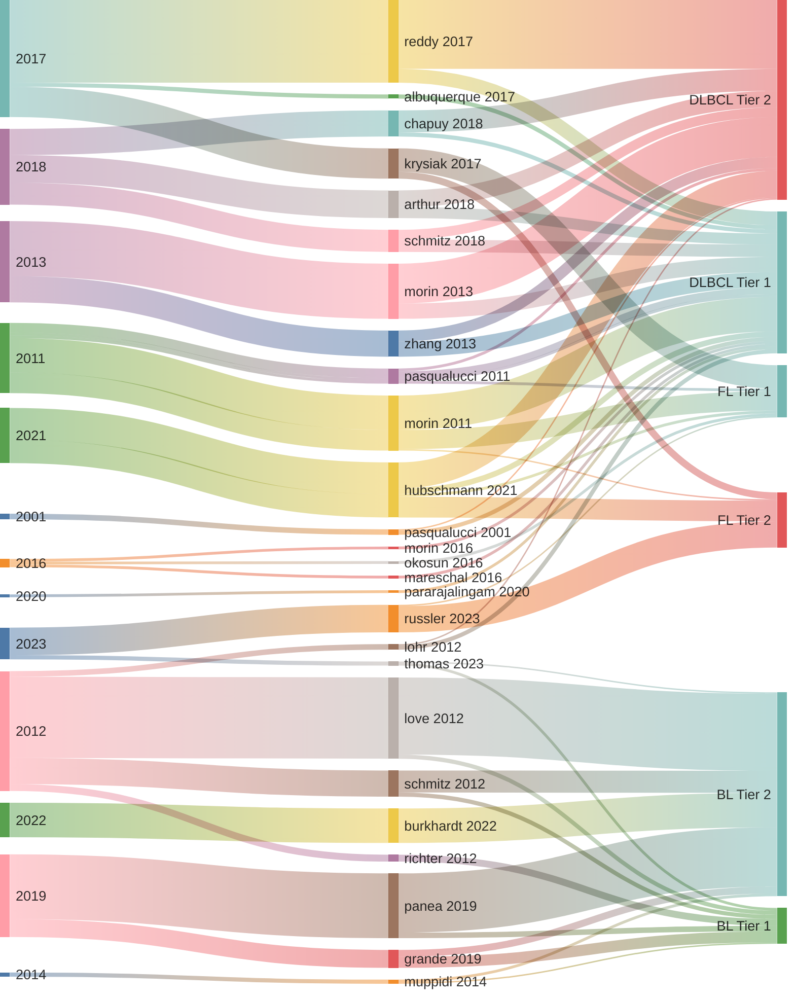

```mermaid


---
config:
  sankey:
    showValues: false
    width: 800
    height: 1000
---
sankey-beta
2001, pasqualucci 2001, 4
pasqualucci 2001, DLBCL Tier 2, 1
pasqualucci 2001, DLBCL Tier 1, 3
2011, morin 2011, 25
2011, pasqualucci 2011, 7
pasqualucci 2011, DLBCL Tier 1, 5
pasqualucci 2011, DLBCL Tier 2, 2
2012, schmitz 2012, 19
2012, love 2012, 59
zhang 2013, DLBCL Tier 1, 11
zhang 2013, DLBCL Tier 2, 8
2016, morin 2016, 2
2017, albuquerque 2017, 3
2017, reddy 2017, 60
2018, schmitz 2018, 16
2012, lohr 2012, 4

2018, arthur 2018, 20
2020, pararajalingam 2020, 2
2016, mareschal 2016, 2
2018, chapuy 2018, 19
2021, hubschmann 2021, 23
2013, zhang 2013, 19
2013, morin 2013, 40
2011, pasqualucci 2011, 2
reddy 2017, DLBCL Tier 2, 50
reddy 2017, DLBCL Tier 1, 10
morin 2016, DLBCL Tier 1, 2
albuquerque 2017, DLBCL Tier 1, 3
schmitz 2018, DLBCL Tier 2, 7
schmitz 2018, DLBCL Tier 1, 9
lohr 2012, DLBCL Tier 2, 1
lohr 2012, DLBCL Tier 1, 3
mareschal 2016, DLBCL Tier 1, 2
pararajalingam 2020, DLBCL Tier 1, 2
arthur 2018, DLBCL Tier 2, 12
arthur 2018, DLBCL Tier 1, 8


hubschmann 2021, DLBCL Tier 1, 4
hubschmann 2021, DLBCL Tier 2, 19
chapuy 2018, DLBCL Tier 2, 16
chapuy 2018, DLBCL Tier 1, 3

morin 2011, DLBCL Tier 1, 25
morin 2013, DLBCL Tier 2, 29
morin 2013, DLBCL Tier 1, 11
pasqualucci 2011, DLBCL Tier 1, 2
2011, pasqualucci 2011, 2
2017, krysiak 2017, 22
2016, okosun 2016, 2
2011, morin 2011, 15
2021, hubschmann 2021, 17
2023, russler 2023, 20
hubschmann 2021, FL Tier 2, 15
hubschmann 2021, FL Tier 1, 2
morin 2011, FL Tier 2, 1
morin 2011, FL Tier 1, 14
okosun 2016, FL Tier 1, 2
pasqualucci 2011, FL Tier 1, 2
krysiak 2017, FL Tier 2, 5
krysiak 2017, FL Tier 1, 17
russler 2023, FL Tier 1, 1
russler 2023, FL Tier 2, 19

2022, burkhardt 2022, 25
2012, richter 2012, 5
2019, panea 2019, 47
2023, thomas 2023, 3
2014, muppidi 2014, 3
2019, grande 2019, 13
burkhardt 2022, BL Tier 2, 25
richter 2012, BL Tier 1, 5
panea 2019, BL Tier 2, 43
panea 2019, BL Tier 1, 4
schmitz 2012, BL Tier 1, 3
schmitz 2012, BL Tier 2, 16
love 2012, BL Tier 1, 3
love 2012, BL Tier 2, 56
muppidi 2014, BL Tier 1, 1
muppidi 2014, BL Tier 2, 2
grande 2019, BL Tier 1, 8
grande 2019, BL Tier 2, 5
thomas 2023, BL Tier 2, 1
thomas 2023, BL Tier 1, 2
```