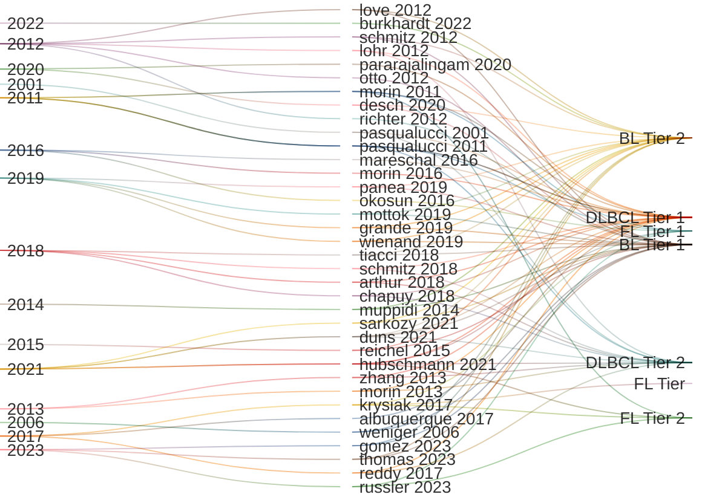

```mermaid


---
config:
  sankey:
    showValues: false
    prefix: "("
    suffix: ")"
---
sankey-beta

albuquerque 2017, DLBCL Tier 1, 3
arthur 2018, DLBCL Tier 1, 8
arthur 2018, DLBCL Tier 2, 12
burkhardt 2022, BL Tier 2, 25
chapuy 2018, DLBCL Tier 1, 3
chapuy 2018, DLBCL Tier 2, 16
desch 2020, BL Tier 1, 1
desch 2020, BL Tier 2, 9
duns 2021, BL Tier 1, 6
duns 2021, BL Tier 2, 8
duns 2021, DLBCL Tier 1, 6
duns 2021, DLBCL Tier 2, 8
gomez 2023, BL Tier 1, 2
gomez 2023, BL Tier 2, 5
grande 2019, BL Tier 1, 8
grande 2019, BL Tier 2, 5
hubschmann 2021, DLBCL Tier 1, 4
hubschmann 2021, DLBCL Tier 2, 19
hubschmann 2021, FL Tier 1, 1
hubschmann 2021, FL Tier 2, 16
krysiak 2017, FL Tier , 1
krysiak 2017, FL Tier 1, 17
krysiak 2017, FL Tier 2, 4
lohr 2012, DLBCL Tier 1, 3
lohr 2012, DLBCL Tier 2, 1
love 2012, BL Tier 1, 3
love 2012, BL Tier 2, 56
mareschal 2016, DLBCL Tier 1, 2
morin 2011, DLBCL Tier 1, 25
morin 2011, FL Tier 1, 14
morin 2011, FL Tier 2, 1
morin 2013, DLBCL Tier 1, 11
morin 2013, DLBCL Tier 2, 29
morin 2016, DLBCL Tier 1, 2
mottok 2019, BL Tier 1, 6
mottok 2019, BL Tier 2, 15
muppidi 2014, BL Tier 1, 1
muppidi 2014, BL Tier 2, 2
okosun 2016, FL Tier 1, 2
otto 2012, BL Tier 1, 2
panea 2019, BL Tier 1, 4
panea 2019, BL Tier 2, 43
pararajalingam 2020, DLBCL Tier 1, 2
pasqualucci 2001, DLBCL Tier 1, 3
pasqualucci 2001, DLBCL Tier 2, 1
pasqualucci 2011, DLBCL Tier 1, 2
pasqualucci 2011, DLBCL Tier 1, 5
pasqualucci 2011, DLBCL Tier 2, 2
pasqualucci 2011, FL Tier 1, 2
reddy 2017, DLBCL Tier 1, 10
reddy 2017, DLBCL Tier 2, 50
reichel 2015, BL Tier 1, 11
reichel 2015, BL Tier 2, 18
richter 2012, BL Tier 1, 5
russler 2023, FL Tier 1, 1
russler 2023, FL Tier 2, 19
sarkozy 2021, BL Tier 1, 5
sarkozy 2021, BL Tier 2, 6
schmitz 2012, BL Tier 1, 4
schmitz 2012, BL Tier 2, 15
schmitz 2018, DLBCL Tier 1, 9
schmitz 2018, DLBCL Tier 2, 7
thomas 2023, BL Tier 1, 2
thomas 2023, BL Tier 2, 1
tiacci 2018, BL Tier 1, 1
tiacci 2018, BL Tier 2, 9
weniger 2006, BL Tier 1, 1
weniger 2006, BL Tier 2, 1
wienand 2019, BL Tier 1, 4
wienand 2019, BL Tier 2, 3
zhang 2013, DLBCL Tier 1, 11
zhang 2013, DLBCL Tier 2, 8
2001, pasqualucci 2001, 4
2006, weniger 2006, 2
2011, morin 2011, 15
2011, morin 2011, 25
2011, pasqualucci 2011, 2
2011, pasqualucci 2011, 2
2011, pasqualucci 2011, 7
2012, lohr 2012, 4
2012, love 2012, 59
2012, otto 2012, 2
2012, richter 2012, 5
2012, schmitz 2012, 19
2013, morin 2013, 40
2013, zhang 2013, 19
2014, muppidi 2014, 3
2015, reichel 2015, 29
2016, mareschal 2016, 2
2016, morin 2016, 2
2016, okosun 2016, 2
2017, albuquerque 2017, 3
2017, krysiak 2017, 22
2017, reddy 2017, 60
2018, arthur 2018, 20
2018, chapuy 2018, 19
2018, schmitz 2018, 16
2018, tiacci 2018, 10
2019, grande 2019, 13
2019, mottok 2019, 21
2019, panea 2019, 47
2019, wienand 2019, 7
2020, desch 2020, 10
2020, pararajalingam 2020, 2
2021, duns 2021, 14
2021, duns 2021, 14
2021, hubschmann 2021, 17
2021, hubschmann 2021, 23
2021, sarkozy 2021, 11
2022, burkhardt 2022, 25
2023, gomez 2023, 7
2023, russler 2023, 20
2023, thomas 2023, 3

```