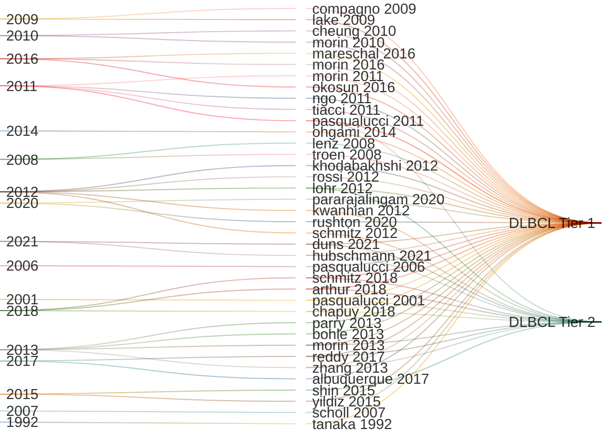

```mermaid


---
config:
  sankey:
    showValues: false
    prefix: "("
    suffix: ")"
---
sankey-beta

albuquerque 2017, DLBCL Tier 1, 3
arthur 2018, DLBCL Tier 1, 8
arthur 2018, DLBCL Tier 2, 12
bohle 2013, DLBCL Tier 1, 1
chapuy 2018, DLBCL Tier 1, 3
chapuy 2018, DLBCL Tier 2, 16
cheung 2010, DLBCL Tier 1, 1
compagno 2009, DLBCL Tier 1, 1
duns 2021, DLBCL Tier 1, 6
duns 2021, DLBCL Tier 2, 8
hubschmann 2021, DLBCL Tier 1, 4
hubschmann 2021, DLBCL Tier 2, 19
khodabakhshi 2012, DLBCL Tier 1, 1
kwanhian 2012, DLBCL Tier 2, 1
lake 2009, DLBCL Tier 1, 1
lenz 2008, DLBCL Tier 1, 1
lohr 2012, DLBCL Tier 1, 3
lohr 2012, DLBCL Tier 2, 1
mareschal 2016, DLBCL Tier 1, 2
morin 2010, DLBCL Tier 1, 1
morin 2011, DLBCL Tier 1, 25
morin 2013, DLBCL Tier 1, 11
morin 2013, DLBCL Tier 2, 29
morin 2016, DLBCL Tier 1, 2
ngo 2011, DLBCL Tier 1, 1
ohgami 2014, DLBCL Tier 1, 1
okosun 2016, DLBCL Tier 1, 1
pararajalingam 2020, DLBCL Tier 1, 2
parry 2013, DLBCL Tier 1, 1
pasqualucci 2001, DLBCL Tier 1, 3
pasqualucci 2001, DLBCL Tier 2, 1
pasqualucci 2006, DLBCL Tier 1, 1
pasqualucci 2011, DLBCL Tier 1, 2
pasqualucci 2011, DLBCL Tier 1, 5
pasqualucci 2011, DLBCL Tier 2, 2
reddy 2017, DLBCL Tier 1, 10
reddy 2017, DLBCL Tier 2, 50
rossi 2012, DLBCL Tier 1, 1
rushton 2020, DLBCL Tier 1, 1
schmitz 2012, DLBCL Tier 2, 1
schmitz 2018, DLBCL Tier 1, 9
schmitz 2018, DLBCL Tier 2, 7
scholl 2007, DLBCL Tier 1, 1
shin 2015, DLBCL Tier 2, 1
tanaka 1992, DLBCL Tier 1, 1
tiacci 2011, DLBCL Tier 1, 1
troen 2008, DLBCL Tier 1, 1
yildiz 2015, DLBCL Tier 1, 1
zhang 2013, DLBCL Tier 1, 11
zhang 2013, DLBCL Tier 2, 8
1992, tanaka 1992, 1
2001, pasqualucci 2001, 4
2006, pasqualucci 2006, 1
2007, scholl 2007, 1
2008, lenz 2008, 1
2008, troen 2008, 1
2009, compagno 2009, 1
2009, lake 2009, 1
2010, cheung 2010, 1
2010, morin 2010, 1
2011, morin 2011, 25
2011, ngo 2011, 1
2011, pasqualucci 2011, 2
2011, pasqualucci 2011, 7
2011, tiacci 2011, 1
2012, khodabakhshi 2012, 1
2012, kwanhian 2012, 1
2012, lohr 2012, 4
2012, rossi 2012, 1
2012, schmitz 2012, 1
2013, bohle 2013, 1
2013, morin 2013, 40
2013, parry 2013, 1
2013, zhang 2013, 19
2014, ohgami 2014, 1
2015, shin 2015, 1
2015, yildiz 2015, 1
2016, mareschal 2016, 2
2016, morin 2016, 2
2016, okosun 2016, 1
2017, albuquerque 2017, 3
2017, reddy 2017, 60
2018, arthur 2018, 20
2018, chapuy 2018, 19
2018, schmitz 2018, 16
2020, pararajalingam 2020, 2
2020, rushton 2020, 1
2021, duns 2021, 14
2021, hubschmann 2021, 23

```