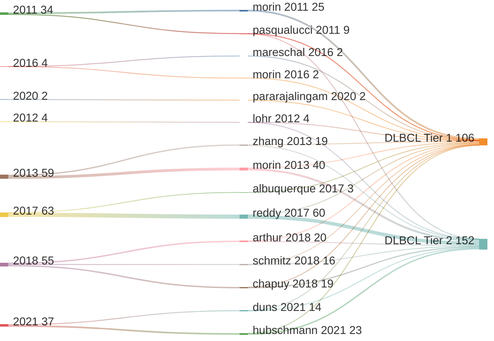

```mermaid


---
config:
  sankey:
    showValues: true
    useMaxWidth: true
---
sankey-beta

morin 2011, DLBCL Tier 1, 25
pasqualucci 2011, DLBCL Tier 1, 2
pasqualucci 2011, DLBCL Tier 1, 5
pasqualucci 2011, DLBCL Tier 2, 2

2011, morin 2011, 25
2011, pasqualucci 2011, 2
2011, pasqualucci 2011, 7

2012, lohr 2012, 4
lohr 2012, DLBCL Tier 1, 3
lohr 2012, DLBCL Tier 2, 1

morin 2013, DLBCL Tier 1, 11
morin 2013, DLBCL Tier 2, 29
2013, morin 2013, 40
2013, zhang 2013, 19
zhang 2013, DLBCL Tier 1, 11
zhang 2013, DLBCL Tier 2, 8


mareschal 2016, DLBCL Tier 1, 2
morin 2016, DLBCL Tier 1, 2
2016, mareschal 2016, 2
2016, morin 2016, 2

reddy 2017, DLBCL Tier 1, 10
reddy 2017, DLBCL Tier 2, 50
albuquerque 2017, DLBCL Tier 1, 3
2017, albuquerque 2017, 3
2017, reddy 2017, 60

2018, arthur 2018, 20
2018, chapuy 2018, 19
2018, schmitz 2018, 16
schmitz 2018, DLBCL Tier 1, 9
schmitz 2018, DLBCL Tier 2, 7
arthur 2018, DLBCL Tier 1, 8
arthur 2018, DLBCL Tier 2, 12
chapuy 2018, DLBCL Tier 1, 3
chapuy 2018, DLBCL Tier 2, 16
2020, pararajalingam 2020, 2
pararajalingam 2020, DLBCL Tier 1, 2

2021, duns 2021, 14
2021, hubschmann 2021, 23
duns 2021, DLBCL Tier 1, 6
duns 2021, DLBCL Tier 2, 8
hubschmann 2021, DLBCL Tier 1, 4
hubschmann 2021, DLBCL Tier 2, 19


```