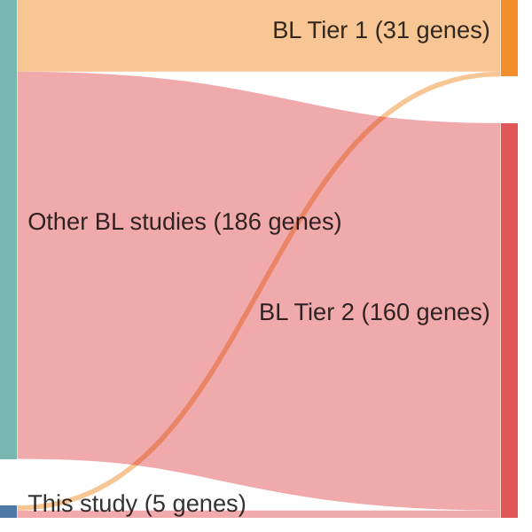

# @thomasGeneticSubgroupsInform2023
## Summary of novel genes

|Entity| Tier 1 genes| Tier 2 genes|
|:-:|:-:|:-:|
|BL|2|3|

## Novel genes reported in this study

|New gene|BL tier|
|:-|:-:|
|[CDKN2C](CDKN2C)|2 |
|[EBF1](EBF1)|2 |
|[EHD1](EHD1)|2 |
|[PHF6](PHF6)|1 |
|[WNK1](WNK1)|1 |

# Details

