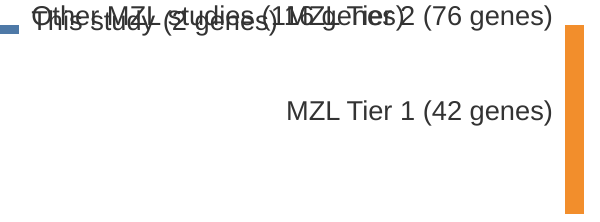

# @vandenbrandRecurrentMutationsGenes2017
## Summary of novel genes

|Entity| Tier 1 genes| Tier 2 genes|
|:-:|:-:|:-:|
|MZL||2|

## Novel genes reported in this study

|New gene|MZL tier|
|:-|:-:|
|[CD9B](CD9B)|2 |
|[TNIP2](TNIP2)|2 |

# Details

