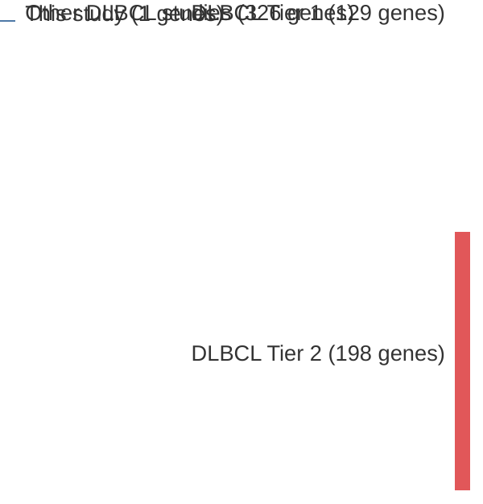

# @yildizActivatingSTAT6Mutations2015c
## Summary of novel genes

|Entity| Tier 1 genes| Tier 2 genes|
|:-:|:-:|:-:|
|FL|1||
|DLBCL|1||

## Novel genes reported in this study

|New gene|FL tier|DLBCL tier|
|:-|:-:|:-:|
|[STAT6](STAT6)|1 |1 |

# Details

